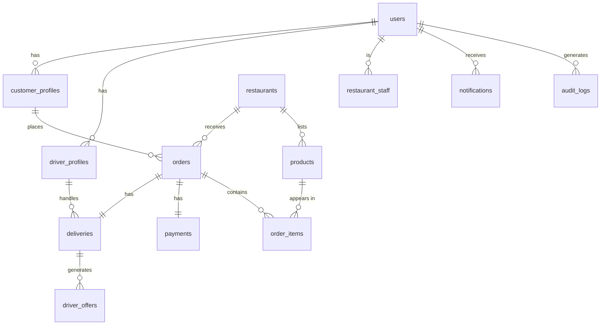
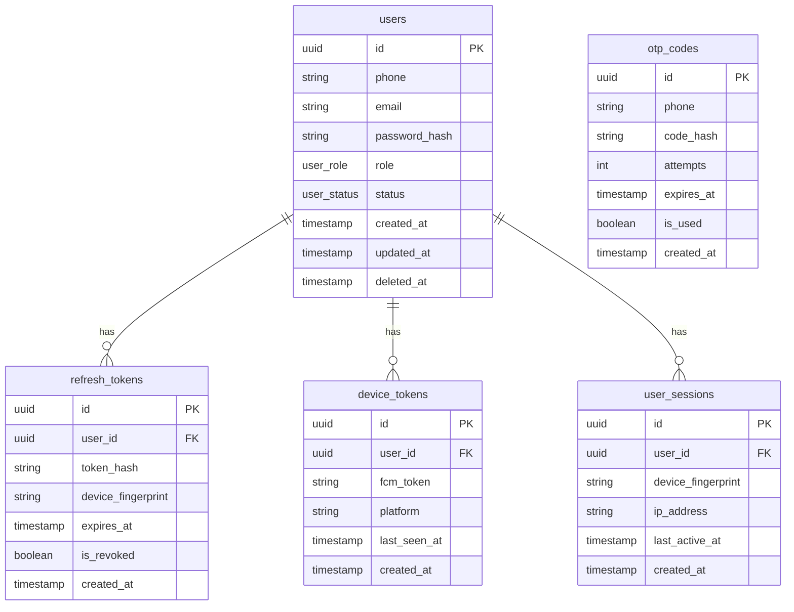
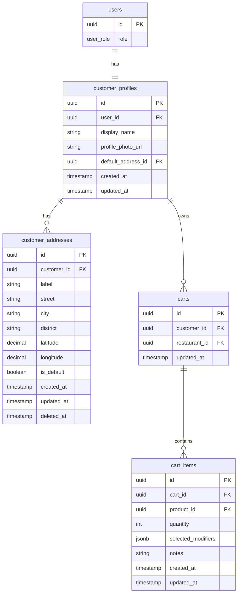
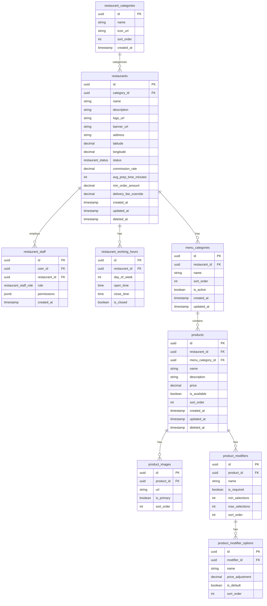
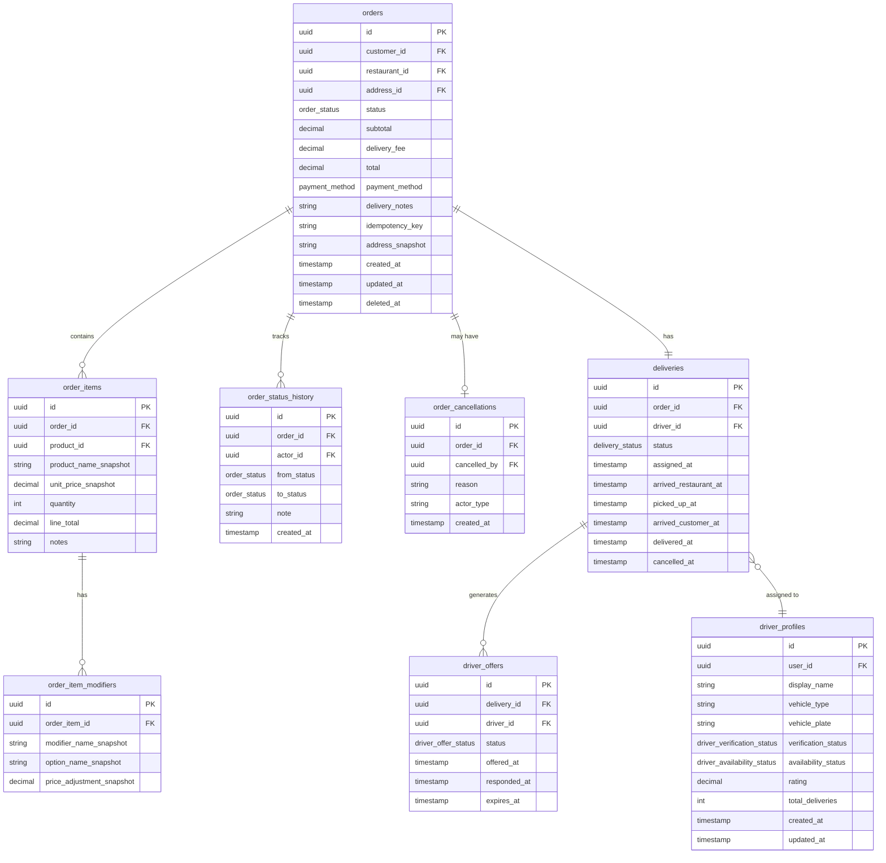
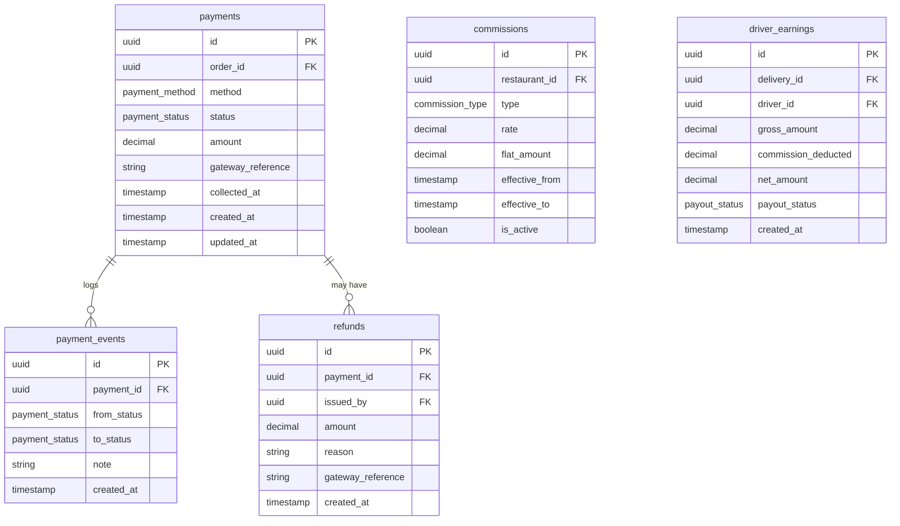
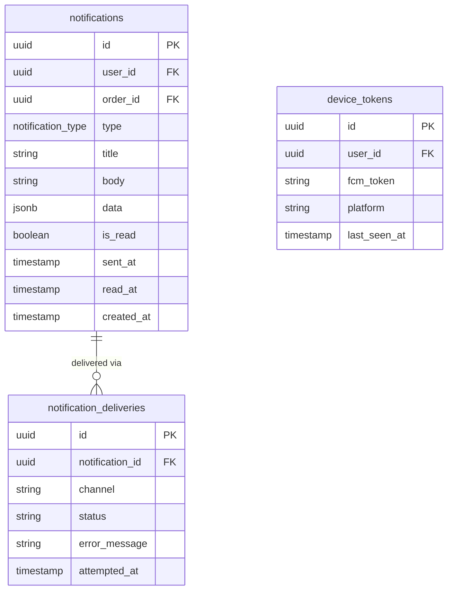
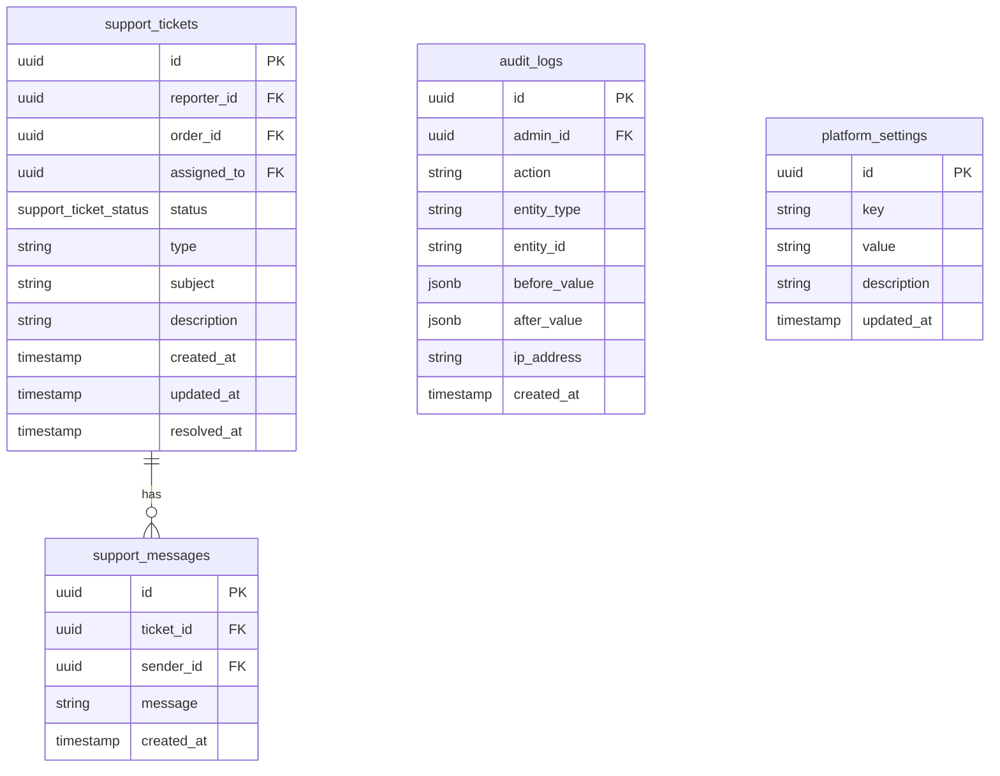

# ERD.md — Database Entity Relationship Document

> **Project:** Local Delivery Platform  
> **Source of Truth:** `DELIVERY_APPS_REQUIREMENTS.md`  
> **Date:** 2026-05-07  
> **Version:** 1.0  
> **Audience:** Database Architects, Backend Engineers, DevOps

---

## Table of Contents

1. [ERD Overview](#1-erd-overview)
2. [Entity Groups](#2-entity-groups)
3. [Complete Entity List](#3-complete-entity-list)
4. [Detailed Relationships](#4-detailed-relationships)
5. [Status Enums](#5-status-enums)
6. [Mermaid ERD Diagrams](#6-mermaid-erd-diagrams)
7. [Indexing Strategy](#7-indexing-strategy)
8. [Data Integrity Rules](#8-data-integrity-rules)
9. [MVP vs Future Database Scope](#9-mvp-vs-future-database-scope)
10. [Assumptions](#10-assumptions)
11. [Open Questions](#11-open-questions)

---

## 1. ERD Overview

### Purpose

This ERD defines the complete relational data model for the delivery platform. The model supports four distinct actors — customers, restaurants, drivers, and admins — communicating through a shared backend, each with their own data domains that intersect at the **order** and **delivery** entities.

### How the Data Model Supports the Platform

| Capability | Core Entities Involved |
|-----------|----------------------|
| Customer browsing | `restaurants`, `menu_categories`, `products`, `product_images` |
| Customer ordering | `carts`, `cart_items`, `orders`, `order_items`, `customer_addresses` |
| Restaurant order handling | `orders`, `order_status_history`, `restaurant_staff` |
| Driver dispatch | `driver_offers`, `deliveries`, `driver_locations`, `driver_profiles` |
| Real-time tracking | `driver_locations`, `deliveries` |
| Order lifecycle | `orders`, `order_status_history`, `order_cancellations` |
| Payments & finance | `payments`, `commissions`, `driver_earnings`, `restaurant_payouts`, `driver_payouts` |
| Push notifications | `device_tokens`, `notifications`, `notification_deliveries` |
| Weak internet / idempotency | `orders.idempotency_key`, `otp_codes`, `user_sessions` |
| Admin oversight | `audit_logs`, `platform_settings`, `support_tickets` |
| Geography / zones | `zones`, `zone_restaurants`, `zone_drivers` |

### Design Principles

- **UUID primary keys** everywhere — safe for distributed systems and avoids enumeration attacks.
- **Soft deletes** (`deleted_at`) on core business entities (restaurants, products, orders) to preserve audit history.
- **Status enums** defined at the PostgreSQL level for data integrity.
- **Snapshot fields** on `order_items` (price, product name) to protect historical accuracy when menus change.
- **Idempotency keys** on `orders` to prevent duplicate submissions under poor connectivity.
- **Append-only** status history tables (`order_status_history`, `driver_status_history`) for full auditability.
- **No hard dependencies** from financial tables back to mutable menu data — all amounts are stored at transaction time.

---

## 2. Entity Groups

### 2.1 Identity & Access

Handles user accounts, authentication sessions, OTP, and device token registration across all three apps.

| Entity | Short Description |
|--------|------------------|
| `users` | Master identity record for all actors |
| `user_sessions` | Active session tracking per device |
| `refresh_tokens` | Persistent refresh token storage |
| `otp_codes` | One-time phone verification codes |
| `device_tokens` | FCM push notification tokens per device |

---

### 2.2 Customer Domain

Customer-specific extensions and shopping state.

| Entity | Short Description |
|--------|------------------|
| `customer_profiles` | Extended customer data linked to `users` |
| `customer_addresses` | Saved delivery addresses |
| `carts` | Active cart per customer (one per restaurant) |
| `cart_items` | Individual items in a cart |
| `favorites` | Customer-favorited restaurants *(Post-MVP)* |

---

### 2.3 Restaurant / Store Domain

Restaurant configuration, staffing, and menu structure.

| Entity | Short Description |
|--------|------------------|
| `restaurants` | Core restaurant record |
| `restaurant_staff` | Staff accounts linked to a restaurant |
| `restaurant_categories` | Platform-level categories (e.g., Fast Food, Grocery) |
| `restaurant_working_hours` | Per-day operating schedule |
| `restaurant_special_hours` | Holiday/override hours *(Post-MVP)* |
| `menu_categories` | Restaurant-specific menu sections (e.g., Starters) |
| `products` | Menu items / products |
| `product_images` | Multiple images per product |
| `product_modifiers` | Modifier groups (e.g., "Choose size") |
| `product_modifier_options` | Options within a modifier group (e.g., Small, Medium, Large) |

---

### 2.4 Order Domain

The central business flow — from cart to delivered state.

| Entity | Short Description |
|--------|------------------|
| `orders` | Placed order record — central entity |
| `order_items` | Snapshot of each ordered product |
| `order_item_modifiers` | Snapshot of selected modifiers per item |
| `order_status_history` | Append-only log of every status change |
| `order_cancellations` | Cancellation reason and actor |

---

### 2.5 Delivery / Driver Domain

Driver identity, location tracking, dispatch, and delivery lifecycle.

| Entity | Short Description |
|--------|------------------|
| `driver_profiles` | Extended driver data linked to `users` |
| `driver_documents` | Uploaded ID, license, vehicle docs |
| `driver_locations` | Location history (append-only) |
| `deliveries` | Active delivery record linked to an order |
| `driver_offers` | Each dispatch offer sent to a driver |
| `driver_status_history` | Log of online/offline/busy toggles |
| `driver_earnings` | Per-delivery earnings record |

---

### 2.6 Payment & Finance Domain

Tracks money flow from order placement through commission deduction and payout.

| Entity | Short Description |
|--------|------------------|
| `payments` | Payment record per order |
| `payment_events` | Append-only log of payment state changes |
| `refunds` | Refund records per payment |
| `commissions` | Commission rate configuration |
| `restaurant_payouts` | Payout batches to restaurants |
| `driver_payouts` | Payout batches to drivers |
| `payout_items` | Line items inside a payout batch |

---

### 2.7 Notification & Realtime Domain

Push notification records and optional realtime event logging.

| Entity | Short Description |
|--------|------------------|
| `notifications` | Notification record per user |
| `notification_deliveries` | Delivery attempt per channel (FCM, socket) |
| `realtime_event_logs` | Optional debug log of socket events *(Post-MVP)* |

---

### 2.8 Support & Admin Domain

Customer support, dispute resolution, admin audit trail, and platform configuration.

| Entity | Short Description |
|--------|------------------|
| `support_tickets` | Dispute or support request |
| `support_messages` | Thread of messages per ticket |
| `audit_logs` | Immutable log of all admin actions |
| `platform_settings` | Key-value store for global config |

---

### 2.9 Geography Domain

Delivery zone management for future zone-based dispatch.

| Entity | Short Description |
|--------|------------------|
| `zones` | Geographic delivery area (polygon) |
| `zone_restaurants` | Many-to-many: zones ↔ restaurants |
| `zone_drivers` | Many-to-many: zones ↔ drivers |

---

## 3. Complete Entity List

### 3.1 Identity & Access

#### `users`
- **Purpose:** Single source of identity for all actors (customers, restaurant owners, drivers, admins).
- **Main relationships:** Parent of `customer_profiles`, `driver_profiles`, `restaurant_staff`, `refresh_tokens`, `otp_codes`, `device_tokens`
- **Scope:** MVP

#### `user_sessions`
- **Purpose:** Track active sessions for device management and forced logout.
- **Main relationships:** Belongs to `users`
- **Scope:** MVP

#### `refresh_tokens`
- **Purpose:** Persistent, rotatable refresh tokens for JWT renewal.
- **Main relationships:** Belongs to `users`
- **Scope:** MVP

#### `otp_codes`
- **Purpose:** Store hashed OTP codes with expiry for phone-based authentication.
- **Main relationships:** Linked to phone number (not FK to users — pre-registration)
- **Scope:** MVP

#### `device_tokens`
- **Purpose:** Store FCM device tokens per user per device for push notifications.
- **Main relationships:** Belongs to `users`
- **Scope:** MVP

---

### 3.2 Customer Domain

#### `customer_profiles`
- **Purpose:** Extended customer data (display name, profile photo) separate from the base user.
- **Main relationships:** One-to-one with `users`; references `customer_addresses` for default address
- **Scope:** MVP

#### `customer_addresses`
- **Purpose:** Saved delivery addresses with coordinates for map selection.
- **Main relationships:** Belongs to `customer_profiles`; referenced by `orders`
- **Scope:** MVP

#### `carts`
- **Purpose:** Active cart state per customer, linked to one restaurant at a time.
- **Main relationships:** Belongs to `customer_profiles`; references `restaurants`; has many `cart_items`
- **Scope:** MVP

#### `cart_items`
- **Purpose:** Individual items in the cart with quantity and modifiers.
- **Main relationships:** Belongs to `carts`; references `products`
- **Scope:** MVP

#### `favorites`
- **Purpose:** Customer-saved favorite restaurants for quick access.
- **Main relationships:** Belongs to `customer_profiles`; references `restaurants`
- **Scope:** Post-MVP

---

### 3.3 Restaurant / Store Domain

#### `restaurants`
- **Purpose:** Core restaurant record with business info, coordinates, status, and commission config.
- **Main relationships:** Has many `restaurant_staff`, `menu_categories`, `orders`, `restaurant_working_hours`; belongs to owner via `restaurant_staff`
- **Scope:** MVP

#### `restaurant_staff`
- **Purpose:** Link table between `users` and `restaurants` with role and permissions.
- **Main relationships:** Belongs to `users` and `restaurants`
- **Scope:** MVP

#### `restaurant_categories`
- **Purpose:** Platform-level cuisine/store-type categories (e.g., Fast Food, Pharmacy).
- **Main relationships:** Has many `restaurants`
- **Scope:** MVP

#### `restaurant_working_hours`
- **Purpose:** Per-day operating hours for each restaurant.
- **Main relationships:** Belongs to `restaurants`
- **Scope:** MVP

#### `restaurant_special_hours`
- **Purpose:** Holiday overrides and date-specific schedule changes.
- **Main relationships:** Belongs to `restaurants`
- **Scope:** Post-MVP

#### `menu_categories`
- **Purpose:** Restaurant-owned groupings of menu items (e.g., Starters, Mains, Drinks).
- **Main relationships:** Belongs to `restaurants`; has many `products`
- **Scope:** MVP

#### `products`
- **Purpose:** Individual sellable items with price, description, and availability.
- **Main relationships:** Belongs to `menu_categories` and `restaurants`; has many `product_images`, `product_modifiers`
- **Scope:** MVP

#### `product_images`
- **Purpose:** Multiple images per product stored as URLs.
- **Main relationships:** Belongs to `products`
- **Scope:** MVP

#### `product_modifiers`
- **Purpose:** Modifier groups (e.g., "Choose a size", "Add extras").
- **Main relationships:** Belongs to `products`; has many `product_modifier_options`
- **Scope:** MVP

#### `product_modifier_options`
- **Purpose:** Individual options inside a modifier group (e.g., Small +$0, Large +$1.50).
- **Main relationships:** Belongs to `product_modifiers`
- **Scope:** MVP

---

### 3.4 Order Domain

#### `orders`
- **Purpose:** The central business entity. Created when a customer submits a checkout.
- **Main relationships:** Belongs to `customer_profiles`, `restaurants`, `customer_addresses`; has many `order_items`, `order_status_history`; has one `delivery`, `payment`
- **Scope:** MVP

#### `order_items`
- **Purpose:** Snapshot of each ordered product at the time of order. Price and name are copied.
- **Main relationships:** Belongs to `orders`; references `products` (non-cascading for audit); has many `order_item_modifiers`
- **Scope:** MVP

#### `order_item_modifiers`
- **Purpose:** Snapshot of selected modifier options per order item.
- **Main relationships:** Belongs to `order_items`
- **Scope:** MVP

#### `order_status_history`
- **Purpose:** Append-only audit trail of every order status change with actor and timestamp.
- **Main relationships:** Belongs to `orders`; references `users` (the actor who triggered the change)
- **Scope:** MVP

#### `order_cancellations`
- **Purpose:** Records the reason, actor, and timing of a cancellation.
- **Main relationships:** One-to-one with `orders`; references `users`
- **Scope:** MVP

---

### 3.5 Delivery / Driver Domain

#### `driver_profiles`
- **Purpose:** Extended driver data: vehicle info, verification status, rating.
- **Main relationships:** One-to-one with `users`; has many `deliveries`, `driver_documents`
- **Scope:** MVP

#### `driver_documents`
- **Purpose:** Documents uploaded by driver during registration (ID, license, vehicle registration).
- **Main relationships:** Belongs to `driver_profiles`
- **Scope:** MVP

#### `driver_locations`
- **Purpose:** Time-series location points for a driver (append-only for history; Redis used for live).
- **Main relationships:** Belongs to `driver_profiles`
- **Scope:** MVP

#### `deliveries`
- **Purpose:** Links an order to an assigned driver and tracks the delivery lifecycle.
- **Main relationships:** One-to-one with `orders`; belongs to `driver_profiles`; has many `driver_offers`
- **Scope:** MVP

#### `driver_offers`
- **Purpose:** Records every dispatch offer sent to a driver (accepted, declined, timeout).
- **Main relationships:** Belongs to `deliveries` and `driver_profiles`
- **Scope:** MVP

#### `driver_status_history`
- **Purpose:** Append-only log of when drivers went online/offline.
- **Main relationships:** Belongs to `driver_profiles`
- **Scope:** MVP

#### `driver_earnings`
- **Purpose:** Per-delivery earnings record after commission deduction.
- **Main relationships:** One-to-one with `deliveries`; belongs to `driver_profiles`
- **Scope:** MVP

---

### 3.6 Payment & Finance Domain

#### `payments`
- **Purpose:** One payment record per order. Tracks amount, method, and status.
- **Main relationships:** One-to-one with `orders`
- **Scope:** MVP

#### `payment_events`
- **Purpose:** Append-only log of payment status transitions (e.g., PENDING → COLLECTED).
- **Main relationships:** Belongs to `payments`
- **Scope:** MVP

#### `refunds`
- **Purpose:** Refund record linked to a payment with amount and reason.
- **Main relationships:** Belongs to `payments`; references `users` (admin who issued the refund)
- **Scope:** MVP (COD: no actual refund flow, but record is created for tracking)

#### `commissions`
- **Purpose:** Commission rate configuration — global or per restaurant.
- **Main relationships:** Optionally references `restaurants` (null = global rule)
- **Scope:** MVP

#### `restaurant_payouts`
- **Purpose:** A batch payout to a restaurant covering multiple orders.
- **Main relationships:** Belongs to `restaurants`; has many `payout_items`
- **Scope:** Post-MVP

#### `driver_payouts`
- **Purpose:** A batch payout to a driver covering multiple deliveries.
- **Main relationships:** Belongs to `driver_profiles`; has many `payout_items`
- **Scope:** Post-MVP

#### `payout_items`
- **Purpose:** Line item inside a payout batch (per order or per delivery).
- **Main relationships:** Belongs to `restaurant_payouts` or `driver_payouts`; references `orders` or `deliveries`
- **Scope:** Post-MVP

---

### 3.7 Notification & Realtime Domain

#### `notifications`
- **Purpose:** One notification record per user per event. Supports in-app notification history.
- **Main relationships:** Belongs to `users`; optionally references `orders`
- **Scope:** MVP

#### `notification_deliveries`
- **Purpose:** Tracks per-channel delivery attempt (FCM, socket) and success/failure.
- **Main relationships:** Belongs to `notifications`
- **Scope:** Post-MVP

#### `realtime_event_logs`
- **Purpose:** Debug log of Socket.IO events for troubleshooting.
- **Main relationships:** Optionally references `orders`
- **Scope:** Post-MVP

---

### 3.8 Support & Admin Domain

#### `support_tickets`
- **Purpose:** Customer or restaurant dispute or support request.
- **Main relationships:** Belongs to `users` (reporter); optionally references `orders`; assigned to `users` (support staff)
- **Scope:** MVP (basic)

#### `support_messages`
- **Purpose:** Threaded conversation messages within a ticket.
- **Main relationships:** Belongs to `support_tickets`; belongs to `users` (sender)
- **Scope:** MVP (basic)

#### `audit_logs`
- **Purpose:** Immutable record of all sensitive admin actions.
- **Main relationships:** Belongs to `users` (admin); references target entity by type + ID
- **Scope:** MVP

#### `platform_settings`
- **Purpose:** Key-value store for platform-wide configuration (commission rate, dispatch radius, etc.).
- **Main relationships:** Standalone
- **Scope:** MVP

---

### 3.9 Geography Domain

#### `zones`
- **Purpose:** Named delivery zones stored as GeoJSON polygons.
- **Main relationships:** Has many `zone_restaurants`, `zone_drivers`
- **Scope:** Future

#### `zone_restaurants`
- **Purpose:** Many-to-many join for zone coverage of restaurants.
- **Main relationships:** Belongs to `zones` and `restaurants`
- **Scope:** Future

#### `zone_drivers`
- **Purpose:** Many-to-many join for zone assignment of drivers.
- **Main relationships:** Belongs to `zones` and `driver_profiles`
- **Scope:** Future

---

## 4. Detailed Relationships

| # | Source Table | Target Table | Cardinality | FK Column | Delete Behavior | Notes |
|---|-------------|-------------|-------------|-----------|----------------|-------|
| 1 | `customer_profiles` | `users` | 1:1 | `user_id` | CASCADE | One profile per user |
| 2 | `driver_profiles` | `users` | 1:1 | `user_id` | CASCADE | One profile per user |
| 3 | `restaurant_staff` | `users` | N:1 | `user_id` | RESTRICT | User may belong to one restaurant |
| 4 | `restaurant_staff` | `restaurants` | N:1 | `restaurant_id` | RESTRICT | Staff cannot be deleted if restaurant exists |
| 5 | `refresh_tokens` | `users` | N:1 | `user_id` | CASCADE | All tokens deleted with user |
| 6 | `device_tokens` | `users` | N:1 | `user_id` | CASCADE | All FCM tokens deleted with user |
| 7 | `user_sessions` | `users` | N:1 | `user_id` | CASCADE | Sessions invalidated on user delete |
| 8 | `customer_addresses` | `customer_profiles` | N:1 | `customer_id` | CASCADE | Addresses deleted with profile |
| 9 | `customer_profiles` | `customer_addresses` | N:1 (default) | `default_address_id` | SET NULL | Nullable; self-referential loop avoided by deferral |
| 10 | `carts` | `customer_profiles` | N:1 | `customer_id` | CASCADE | One active cart per customer-restaurant pair |
| 11 | `carts` | `restaurants` | N:1 | `restaurant_id` | RESTRICT | Cart references active restaurant |
| 12 | `cart_items` | `carts` | N:1 | `cart_id` | CASCADE | Cart delete clears items |
| 13 | `cart_items` | `products` | N:1 | `product_id` | RESTRICT | Product must exist to be in cart |
| 14 | `restaurants` | `restaurant_categories` | N:1 | `category_id` | SET NULL | Category deletion does not delete restaurants |
| 15 | `restaurant_working_hours` | `restaurants` | N:1 | `restaurant_id` | CASCADE | Hours deleted with restaurant |
| 16 | `restaurant_special_hours` | `restaurants` | N:1 | `restaurant_id` | CASCADE | Special hours deleted with restaurant |
| 17 | `menu_categories` | `restaurants` | N:1 | `restaurant_id` | CASCADE | Menu categories tied to restaurant |
| 18 | `products` | `menu_categories` | N:1 | `menu_category_id` | RESTRICT | Cannot delete a category with products |
| 19 | `products` | `restaurants` | N:1 | `restaurant_id` | CASCADE | Products belong to restaurant (denormalized FK for performance) |
| 20 | `product_images` | `products` | N:1 | `product_id` | CASCADE | Images deleted with product |
| 21 | `product_modifiers` | `products` | N:1 | `product_id` | CASCADE | Modifiers deleted with product |
| 22 | `product_modifier_options` | `product_modifiers` | N:1 | `modifier_id` | CASCADE | Options deleted with modifier |
| 23 | `orders` | `customer_profiles` | N:1 | `customer_id` | RESTRICT | Orders must not be deleted |
| 24 | `orders` | `restaurants` | N:1 | `restaurant_id` | RESTRICT | Orders must not be deleted |
| 25 | `orders` | `customer_addresses` | N:1 | `address_id` | SET NULL | Address can be deleted; snapshot saved in order |
| 26 | `order_items` | `orders` | N:1 | `order_id` | CASCADE | Items deleted with order (soft delete only) |
| 27 | `order_items` | `products` | N:1 (snapshot) | `product_id` | SET NULL | Product may be deleted; snapshot fields preserved |
| 28 | `order_item_modifiers` | `order_items` | N:1 | `order_item_id` | CASCADE | Modifier snapshots deleted with item |
| 29 | `order_status_history` | `orders` | N:1 | `order_id` | CASCADE | History tied to order |
| 30 | `order_status_history` | `users` | N:1 | `actor_id` | SET NULL | Actor may be null (system-triggered) |
| 31 | `order_cancellations` | `orders` | 1:1 | `order_id` | CASCADE | One cancellation per order |
| 32 | `order_cancellations` | `users` | N:1 | `cancelled_by` | SET NULL | Actor may be system |
| 33 | `deliveries` | `orders` | 1:1 | `order_id` | CASCADE | One delivery per order |
| 34 | `deliveries` | `driver_profiles` | N:1 | `driver_id` | RESTRICT | Driver must exist |
| 35 | `driver_offers` | `deliveries` | N:1 | `delivery_id` | CASCADE | Offers tied to delivery |
| 36 | `driver_offers` | `driver_profiles` | N:1 | `driver_id` | RESTRICT | Driver must exist |
| 37 | `driver_locations` | `driver_profiles` | N:1 | `driver_id` | CASCADE | Location history deleted with driver |
| 38 | `driver_documents` | `driver_profiles` | N:1 | `driver_id` | CASCADE | Documents tied to driver |
| 39 | `driver_status_history` | `driver_profiles` | N:1 | `driver_id` | CASCADE | Status history tied to driver |
| 40 | `driver_earnings` | `deliveries` | 1:1 | `delivery_id` | CASCADE | One earnings record per delivery |
| 41 | `driver_earnings` | `driver_profiles` | N:1 | `driver_id` | RESTRICT | Driver must exist |
| 42 | `payments` | `orders` | 1:1 | `order_id` | RESTRICT | Payment tied to order |
| 43 | `payment_events` | `payments` | N:1 | `payment_id` | CASCADE | Events tied to payment |
| 44 | `refunds` | `payments` | N:1 | `payment_id` | RESTRICT | Refund references payment |
| 45 | `refunds` | `users` | N:1 | `issued_by` | SET NULL | Admin who issued refund |
| 46 | `commissions` | `restaurants` | N:1 (nullable) | `restaurant_id` | CASCADE | Null = global rule |
| 47 | `notifications` | `users` | N:1 | `user_id` | CASCADE | Notifications deleted with user |
| 48 | `notifications` | `orders` | N:1 (nullable) | `order_id` | SET NULL | Order reference optional |
| 49 | `notification_deliveries` | `notifications` | N:1 | `notification_id` | CASCADE | |
| 50 | `support_tickets` | `users` | N:1 | `reporter_id` | RESTRICT | Reporter must exist |
| 51 | `support_tickets` | `orders` | N:1 (nullable) | `order_id` | SET NULL | Ticket may reference an order |
| 52 | `support_tickets` | `users` | N:1 (nullable) | `assigned_to` | SET NULL | Support agent |
| 53 | `support_messages` | `support_tickets` | N:1 | `ticket_id` | CASCADE | |
| 54 | `support_messages` | `users` | N:1 | `sender_id` | RESTRICT | |
| 55 | `audit_logs` | `users` | N:1 | `admin_id` | RESTRICT | Admin must exist |
| 56 | `zone_restaurants` | `zones` | N:1 | `zone_id` | CASCADE | |
| 57 | `zone_restaurants` | `restaurants` | N:1 | `restaurant_id` | CASCADE | |
| 58 | `zone_drivers` | `zones` | N:1 | `zone_id` | CASCADE | |
| 59 | `zone_drivers` | `driver_profiles` | N:1 | `driver_id` | CASCADE | |
| 60 | `restaurant_payouts` | `restaurants` | N:1 | `restaurant_id` | RESTRICT | |
| 61 | `driver_payouts` | `driver_profiles` | N:1 | `driver_id` | RESTRICT | |
| 62 | `payout_items` | `restaurant_payouts` | N:1 (nullable) | `restaurant_payout_id` | CASCADE | |
| 63 | `payout_items` | `driver_payouts` | N:1 (nullable) | `driver_payout_id` | CASCADE | |
| 64 | `payout_items` | `orders` | N:1 (nullable) | `order_id` | RESTRICT | |
| 65 | `favorites` | `customer_profiles` | N:1 | `customer_id` | CASCADE | |
| 66 | `favorites` | `restaurants` | N:1 | `restaurant_id` | RESTRICT | |

---

## 5. Status Enums

### `user_role`
```
CUSTOMER
RESTAURANT_OWNER
RESTAURANT_STAFF
DRIVER
ADMIN
SUPER_ADMIN
SUPPORT
```

### `user_status`
```
ACTIVE
SUSPENDED
BANNED
PENDING_VERIFICATION
```

### `restaurant_status`
```
OPEN
CLOSED
BUSY
TEMPORARILY_CLOSED
PENDING_APPROVAL
SUSPENDED
```

### `restaurant_staff_role`
```
OWNER
MANAGER
STAFF
```

### `driver_verification_status`
```
PENDING_REVIEW
APPROVED
REJECTED
SUSPENDED
```

### `driver_availability_status`
```
OFFLINE
ONLINE
ON_DELIVERY
```

### `order_status`
```
PENDING_RESTAURANT
ACCEPTED_BY_RESTAURANT
REJECTED_BY_RESTAURANT
PREPARING
LOOKING_FOR_DRIVER
DRIVER_OFFERED
DRIVER_ASSIGNED
DRIVER_ARRIVED_RESTAURANT
PICKED_UP
ON_THE_WAY
ARRIVED_CUSTOMER
DELIVERED
CANCELLED
FAILED
```

### `delivery_status`
```
PENDING
DRIVER_ASSIGNED
DRIVER_HEADING_TO_RESTAURANT
DRIVER_ARRIVED_RESTAURANT
PICKED_UP
ON_THE_WAY
ARRIVED_CUSTOMER
DELIVERED
CANCELLED
```

### `driver_offer_status`
```
PENDING
ACCEPTED
DECLINED
TIMED_OUT
CANCELLED
```

### `payment_method`
```
CASH_ON_DELIVERY
CARD
WALLET
```

### `payment_status`
```
PENDING
COLLECTED
FAILED
REFUNDED
PARTIALLY_REFUNDED
CANCELLED
```

### `support_ticket_status`
```
OPEN
IN_PROGRESS
WAITING_CUSTOMER
RESOLVED
CLOSED
ESCALATED
```

### `notification_type`
```
ORDER_PLACED
ORDER_ACCEPTED
ORDER_REJECTED
ORDER_PREPARING
DRIVER_ASSIGNED
DRIVER_ARRIVED_RESTAURANT
ORDER_PICKED_UP
ORDER_ON_THE_WAY
ORDER_DELIVERED
ORDER_CANCELLED
DELIVERY_REQUEST
DRIVER_APPROVED
DRIVER_REJECTED
SYSTEM_ANNOUNCEMENT
SUPPORT_REPLY
```

### `payout_status`
```
PENDING
PROCESSING
PAID
FAILED
```

### `commission_type`
```
PERCENTAGE
FLAT_FEE
```

### `document_type`
```
NATIONAL_ID
DRIVING_LICENSE
VEHICLE_REGISTRATION
PROFILE_PHOTO
```

---

## 6. Mermaid ERD Diagrams

> **Note:** Mermaid auto-layouts are non-deterministic. These diagrams are structured in logical entity groupings to minimize line crossings. For visual refinement and interactive navigation, export to [dbdiagram.io](https://dbdiagram.io) or [draw.io](https://draw.io).

---

### 6.1 High-Level Overview ERD

This diagram shows only the top-level inter-domain relationships for system comprehension.



---

### 6.2 Identity & Access ERD



---

### 6.3 Customer Domain ERD



---

### 6.4 Restaurant & Menu Domain ERD



---

### 6.5 Order & Delivery ERD



---

### 6.6 Finance Domain ERD



---

### 6.7 Notification Domain ERD



---

### 6.8 Support & Admin Domain ERD



---

## 7. Indexing Strategy

### `users`
| Index Name | Columns | Type | Reason |
|-----------|---------|------|--------|
| `idx_users_phone` | `phone` | UNIQUE | OTP and login lookup |
| `idx_users_email` | `email` | UNIQUE (nullable) | Email login lookup |
| `idx_users_role` | `role` | B-TREE | Filter users by role in admin |

### `refresh_tokens`
| Index Name | Columns | Type | Reason |
|-----------|---------|------|--------|
| `idx_refresh_tokens_user_id` | `user_id` | B-TREE | Lookup tokens by user |
| `idx_refresh_tokens_hash` | `token_hash` | UNIQUE | Fast token validation |

### `device_tokens`
| Index Name | Columns | Type | Reason |
|-----------|---------|------|--------|
| `idx_device_tokens_user_id` | `user_id` | B-TREE | Send notifications to all user devices |
| `idx_device_tokens_fcm` | `fcm_token` | UNIQUE | Prevent duplicates |

### `otp_codes`
| Index Name | Columns | Type | Reason |
|-----------|---------|------|--------|
| `idx_otp_codes_phone` | `phone` | B-TREE | Rate limit OTP by phone |

### `restaurants`
| Index Name | Columns | Type | Reason |
|-----------|---------|------|--------|
| `idx_restaurants_status` | `status` | B-TREE | Filter open/closed restaurants |
| `idx_restaurants_category_id` | `category_id` | B-TREE | Browse by category |
| `idx_restaurants_location` | `latitude, longitude` | B-TREE | Proximity search (use PostGIS GIST in future) |
| `idx_restaurants_deleted_at` | `deleted_at` | B-TREE | Soft delete filter |

### `products`
| Index Name | Columns | Type | Reason |
|-----------|---------|------|--------|
| `idx_products_restaurant_id` | `restaurant_id` | B-TREE | List all products for a restaurant |
| `idx_products_menu_category_id` | `menu_category_id` | B-TREE | Products per menu section |
| `idx_products_is_available` | `is_available` | B-TREE | Filter available products |
| `idx_products_deleted_at` | `deleted_at` | B-TREE | Soft delete filter |

### `orders`
| Index Name | Columns | Type | Reason |
|-----------|---------|------|--------|
| `idx_orders_customer_id` | `customer_id` | B-TREE | Customer order history |
| `idx_orders_restaurant_id` | `restaurant_id` | B-TREE | Restaurant order list |
| `idx_orders_status` | `status` | B-TREE | Filter orders by status |
| `idx_orders_created_at` | `created_at` | B-TREE | Time-range queries |
| `idx_orders_idempotency_key` | `idempotency_key` | UNIQUE | Prevent duplicate orders |
| `idx_orders_deleted_at` | `deleted_at` | B-TREE | Soft delete filter |

### `order_status_history`
| Index Name | Columns | Type | Reason |
|-----------|---------|------|--------|
| `idx_order_status_history_order_id` | `order_id` | B-TREE | Fast retrieval of status timeline |

### `deliveries`
| Index Name | Columns | Type | Reason |
|-----------|---------|------|--------|
| `idx_deliveries_order_id` | `order_id` | UNIQUE | One delivery per order |
| `idx_deliveries_driver_id` | `driver_id` | B-TREE | Driver's active delivery |
| `idx_deliveries_status` | `status` | B-TREE | Filter by delivery status |

### `driver_offers`
| Index Name | Columns | Type | Reason |
|-----------|---------|------|--------|
| `idx_driver_offers_delivery_id` | `delivery_id` | B-TREE | All offers for a delivery |
| `idx_driver_offers_driver_id` | `driver_id` | B-TREE | Driver's offer history |
| `idx_driver_offers_status` | `status` | B-TREE | Filter pending offers |

### `driver_profiles`
| Index Name | Columns | Type | Reason |
|-----------|---------|------|--------|
| `idx_driver_profiles_availability` | `availability_status` | B-TREE | Dispatch: find online drivers |
| `idx_driver_profiles_verification` | `verification_status` | B-TREE | Admin: filter by status |

### `driver_locations`
| Index Name | Columns | Type | Reason |
|-----------|---------|------|--------|
| `idx_driver_locations_driver_id` | `driver_id` | B-TREE | History per driver |
| `idx_driver_locations_recorded_at` | `recorded_at` | B-TREE | Time-series queries |

### `payments`
| Index Name | Columns | Type | Reason |
|-----------|---------|------|--------|
| `idx_payments_order_id` | `order_id` | UNIQUE | One payment per order |
| `idx_payments_status` | `status` | B-TREE | Financial reporting |

### `notifications`
| Index Name | Columns | Type | Reason |
|-----------|---------|------|--------|
| `idx_notifications_user_id` | `user_id` | B-TREE | User notification inbox |
| `idx_notifications_is_read` | `is_read` | B-TREE | Unread count badge |

### `audit_logs`
| Index Name | Columns | Type | Reason |
|-----------|---------|------|--------|
| `idx_audit_logs_admin_id` | `admin_id` | B-TREE | Logs by admin user |
| `idx_audit_logs_entity` | `entity_type, entity_id` | B-TREE | Logs by target entity |
| `idx_audit_logs_created_at` | `created_at` | B-TREE | Time-range audit queries |

### `support_tickets`
| Index Name | Columns | Type | Reason |
|-----------|---------|------|--------|
| `idx_support_tickets_reporter_id` | `reporter_id` | B-TREE | Tickets by user |
| `idx_support_tickets_status` | `status` | B-TREE | Filter open tickets |

---

## 8. Data Integrity Rules

### 8.1 Snapshot Requirement on Order Items
When an order is created, the following fields MUST be copied from the `products` table into `order_items`:
- `product_name_snapshot` ← `products.name`
- `unit_price_snapshot` ← `products.price`

Similarly, modifier option names and price adjustments must be copied into `order_item_modifiers`. This ensures that historical orders remain accurate even after the restaurant edits or deletes products.

### 8.2 Address Snapshot on Orders
The full delivery address text and coordinates must be stored in `orders.address_snapshot` (JSON) at time of order creation. This prevents order data loss if the customer later edits or deletes the address.

### 8.3 Idempotency Key Uniqueness
`orders.idempotency_key` has a UNIQUE constraint. The backend must check for an existing order with the same key before creating a new one. If found, return the existing order response without creating a duplicate.

### 8.4 Order Status Transition Enforcement
Status transitions are enforced at the application layer (service + guard), not at the database layer. The allowed transition matrix is:

| From | Allowed Next States |
|------|-------------------|
| `PENDING_RESTAURANT` | `ACCEPTED_BY_RESTAURANT`, `REJECTED_BY_RESTAURANT`, `CANCELLED` |
| `ACCEPTED_BY_RESTAURANT` | `PREPARING`, `CANCELLED` |
| `PREPARING` | `LOOKING_FOR_DRIVER` |
| `LOOKING_FOR_DRIVER` | `DRIVER_OFFERED`, `FAILED` |
| `DRIVER_OFFERED` | `DRIVER_ASSIGNED`, `LOOKING_FOR_DRIVER` (retry) |
| `DRIVER_ASSIGNED` | `DRIVER_ARRIVED_RESTAURANT` |
| `DRIVER_ARRIVED_RESTAURANT` | `PICKED_UP` |
| `PICKED_UP` | `ON_THE_WAY` |
| `ON_THE_WAY` | `ARRIVED_CUSTOMER` |
| `ARRIVED_CUSTOMER` | `DELIVERED` |
| `DELIVERED` | *(terminal)* |
| `CANCELLED` | *(terminal)* |
| `FAILED` | *(terminal)* |
| `REJECTED_BY_RESTAURANT` | *(terminal)* |

### 8.5 Single Active Delivery Per Driver
The application enforces that a driver can only be assigned to one active delivery at a time. A driver in `ON_DELIVERY` availability status must not receive new dispatch offers.

### 8.6 Single Active Cart Per Customer Per Restaurant
`carts` has a composite unique constraint on `(customer_id, restaurant_id)`. A new cart for a different restaurant requires either clearing the existing cart or replacing it.

### 8.7 Soft Deletes
The following tables use soft deletes (`deleted_at IS NOT NULL` = deleted). All application queries MUST filter by `deleted_at IS NULL` by default:
- `users`
- `restaurants`
- `products`
- `customer_addresses`
- `orders`

### 8.8 Commission Rate Precedence
When calculating commission for an order:
1. Use `commissions` record where `restaurant_id = order.restaurant_id` and `is_active = true`
2. If none found, use `commissions` record where `restaurant_id IS NULL` and `is_active = true` (global rate)
3. If still none, use `platform_settings` key `default_commission_rate`

### 8.9 Monetary Precision
All monetary columns use `DECIMAL(10,2)` (up to 9,999,999.99). Money is NEVER stored as floating-point. Prisma maps this to `Decimal` type (not `Float`).

---

## 9. MVP vs Future Database Scope

### MVP Required Tables (implement before launch)

| Table | Priority Justification |
|-------|----------------------|
| `users` | All authentication |
| `refresh_tokens` | JWT session persistence |
| `otp_codes` | Phone login |
| `device_tokens` | FCM notifications |
| `user_sessions` | Session management |
| `customer_profiles` | Customer identity |
| `customer_addresses` | Delivery address |
| `carts` | Shopping flow |
| `cart_items` | Shopping flow |
| `restaurants` | Core business entity |
| `restaurant_staff` | Multi-staff support |
| `restaurant_categories` | Browse filtering |
| `restaurant_working_hours` | Open/closed logic |
| `menu_categories` | Menu organization |
| `products` | Orderable items |
| `product_images` | Product display |
| `product_modifiers` | Item customization |
| `product_modifier_options` | Item customization |
| `orders` | Core transaction |
| `order_items` | Order content |
| `order_item_modifiers` | Order content detail |
| `order_status_history` | Lifecycle audit |
| `order_cancellations` | Cancellation tracking |
| `deliveries` | Delivery management |
| `driver_offers` | Dispatch tracking |
| `driver_profiles` | Driver identity |
| `driver_documents` | Verification |
| `driver_locations` | Location history |
| `driver_status_history` | Online/offline log |
| `driver_earnings` | Basic earnings |
| `payments` | COD payment tracking |
| `payment_events` | Payment audit |
| `commissions` | Commission config |
| `notifications` | Push notification records |
| `support_tickets` | Basic dispute handling |
| `support_messages` | Ticket replies |
| `audit_logs` | Admin accountability |
| `platform_settings` | System config |

### Post-MVP Tables

| Table | When Needed |
|-------|------------|
| `favorites` | After user retention features |
| `restaurant_special_hours` | After working hours v1 is stable |
| `notification_deliveries` | When tracking notification success is needed |
| `refunds` | When online payments are added |
| `restaurant_payouts` | When automated payout is built |
| `driver_payouts` | When automated payout is built |
| `payout_items` | With payout system |

### Future Tables

| Table | When Needed |
|-------|------------|
| `zones` | When zone-based dispatch is built |
| `zone_restaurants` | With zones |
| `zone_drivers` | With zones |
| `realtime_event_logs` | When deep socket debugging is required |

---

## 10. Assumptions

- Phone numbers are stored in E.164 format (e.g., `+9647001234567`).
- The platform initially operates in a single currency; multi-currency support is out of scope.
- `driver_locations` is an append-only time-series table. The live location is always served from Redis, not from this table. This table is for history and audit only.
- `orders` are never hard-deleted. Soft delete (`deleted_at`) is the only deletion mechanism.
- PostGIS extension is not assumed for MVP; proximity search uses basic latitude/longitude arithmetic. PostGIS should be introduced when zone polygons are implemented.
- `commissions` table stores rate configurations, not per-order commission calculations. The per-order commission amount is computed and stored on `driver_earnings` and in the payment breakdown.

---

## 11. Open Questions

| # | Question | Impact | Who to Ask |
|---|---------|--------|-----------|
| 1 | Should restaurant owners be able to manage multiple branches under one account? | Affects `restaurants` + `restaurant_staff` structure | Product Owner |
| 2 | Is there a minimum order amount enforced globally or only per-restaurant? | `platform_settings` vs `restaurants.min_order_amount` | Product Owner |
| 3 | Should cancelled orders ever be retried (re-placed automatically)? | Order lifecycle design | Product Owner |
| 4 | What is the exact OTP expiry window and max retry count? | `otp_codes` table design | Operations |
| 5 | Should driver earnings be calculated at delivery time or at payout time? | `driver_earnings` schema | Finance / Product Owner |
| 6 | Is there a review system for drivers in MVP or only for restaurants? | `reviews` table scope | Product Owner |
| 7 | Should admins be able to impersonate users for debugging? | `audit_logs` + security design | Security / Legal |
| 8 | What is the data retention policy for `driver_locations`? | Storage cost, privacy compliance | Legal / DevOps |
| 9 | Is multi-language content (Arabic/English) needed on product names/descriptions in MVP? | `products` schema (i18n fields) | Product Owner |
| 10 | Should cart be server-side (as designed) or fully client-side? | Affects `carts` and `cart_items` tables | Engineering |

---

## ملخص الملف

**ما هدف هذا الملف؟**

هذا الملف هو **خريطة العلاقات بين جداول قاعدة البيانات** — يُجيب على سؤال: كيف ترتبط البيانات ببعضها؟

يحتوي على:
- رسم بياني يوضح كل جدول والعلاقات بينها (One-to-Many، Many-to-Many)
- قائمة بكل الكيانات الرئيسية في النظام (User، Order، Driver، Restaurant...)
- أنواع العلاقات: مثلاً كل أوردر له سائق واحد، لكن كل سائق له أوردرات كثيرة
- القيود المهمة (Constraints) مثل أن السائق لا يمكن أن يكون مسؤول عن أوردرين في نفس الوقت

**من يقرأه؟** المهندس قبل ما يبدأ يكتب أي كود في قاعدة البيانات. هو المرجع التصميمي للـ Schema.

**القاعدة:** إذا أردت أن تفهم كيف ينتقل الأوردر من الزبون للمطعم للسائق على مستوى البيانات — هذا الملف يُجيبك.
