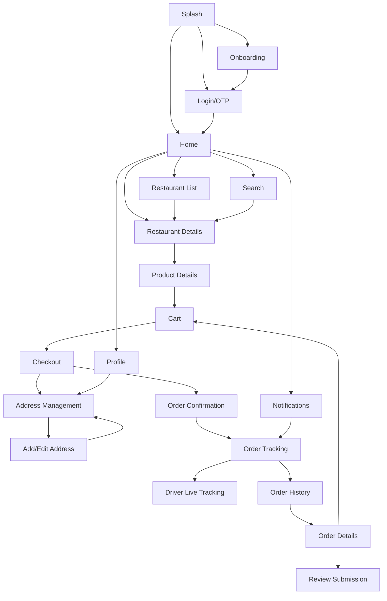
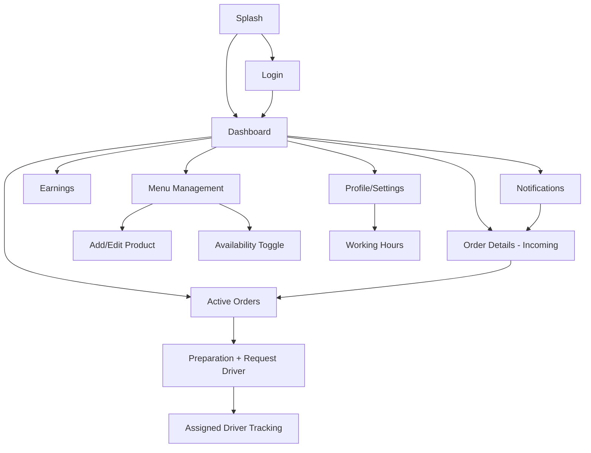
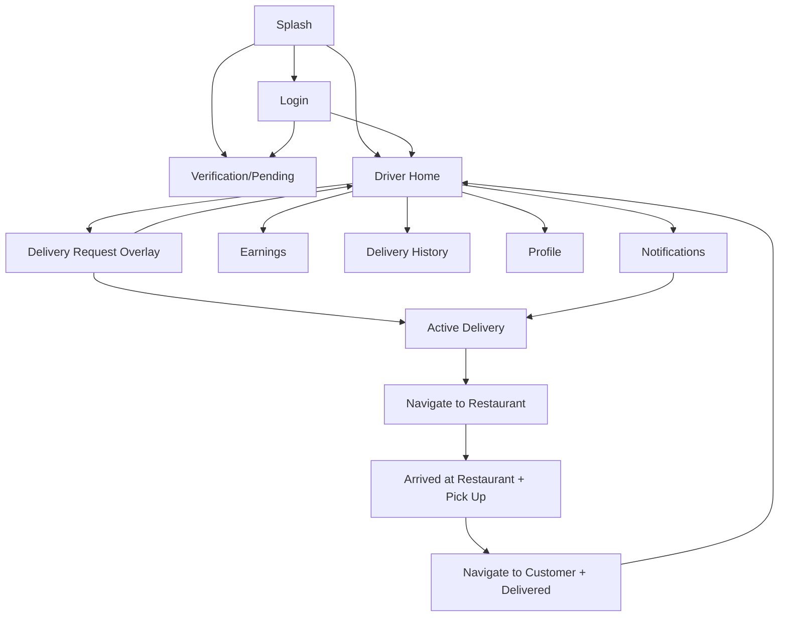
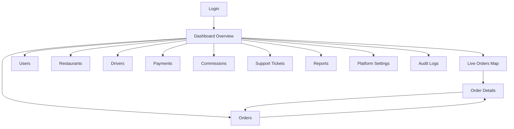
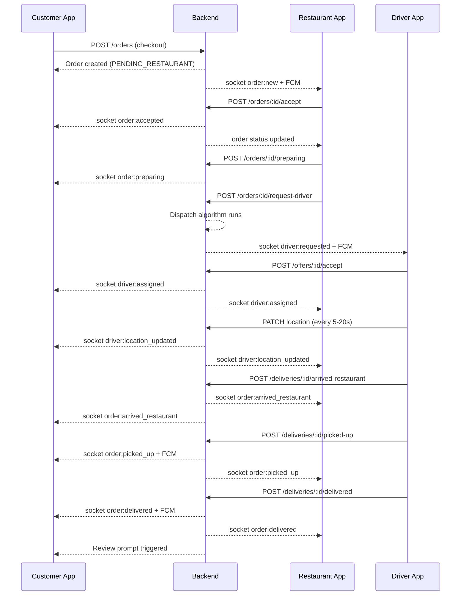

# PAGES_ERD.md — Screen Flow & Data Dependency Document

> **Project:** Local Delivery Platform  
> **Source of Truth:** `DELIVERY_APPS_REQUIREMENTS.md` + `ERD.md`  
> **Date:** 2026-05-07  
> **Version:** 1.0  
> **Audience:** Mobile Engineers, Frontend Engineers, UX Designers, Backend Engineers

---

## Table of Contents

1. [Overview](#1-overview)
2. [Customer App Pages](#2-customer-app-pages)
3. [Restaurant / Store App Pages](#3-restaurant--store-app-pages)
4. [Driver App Pages](#4-driver-app-pages)
5. [Admin Dashboard Pages](#5-admin-dashboard-pages)
6. [Mermaid Page Flow Diagrams](#6-mermaid-page-flow-diagrams)
7. [Page-to-Entity Matrix](#7-page-to-entity-matrix)
8. [Page-to-API Matrix](#8-page-to-api-matrix)
9. [Assumptions](#9-assumptions)
10. [Open Questions](#10-open-questions)

---

## 1. Overview

### Purpose

This document maps every screen in all four interfaces — Customer App, Restaurant App, Driver App, and Admin Dashboard — to:

- The **user role** allowed to access it
- The **entry and exit points** (navigation flow)
- The **database entities** it reads or writes
- The **API endpoints** it calls
- The **Socket.IO realtime events** it listens to or emits
- The **FCM notifications** that deep-link into it
- The **loading, empty, error, and offline states** it must handle

This document is the bridge between the ERD and the API contracts. It ensures that UI developers know exactly what data each screen needs, and backend developers know which endpoints must be ready before each screen can be implemented.

### How Pages Connect to the System

```
User Action
    │
    ▼
Flutter Page
    ├── Calls REST API (Dio) → Backend → PostgreSQL / Prisma
    ├── Listens to Socket.IO events → Realtime updates
    ├── Receives FCM notification → Deep link into page
    └── Reads local cache (Hive) → Offline fallback
```

### Screen Naming Conventions

| App | Prefix |
|-----|--------|
| Customer App | `C-` |
| Restaurant App | `R-` |
| Driver App | `D-` |
| Admin Dashboard | `A-` |

---

## 2. Customer App Pages

---

### C-01: Splash Screen

| Attribute | Detail |
|-----------|--------|
| **Purpose** | App initialization — check auth state, load config, decide routing |
| **User Role** | Any (unauthenticated or authenticated) |
| **Entry Points** | App cold start |
| **Exit Points** | → C-02 (Onboarding) if first launch; → C-04 (Home) if token valid; → C-03 (Login) if token invalid/expired |
| **Required Entities** | None |
| **Required APIs** | `GET /api/v1/auth/me` (silent token validation) |
| **Realtime Events** | None |
| **FCM Deep Links** | None |
| **Loading State** | Logo animation / branded splash |
| **Empty State** | N/A |
| **Error State** | If `/auth/me` fails with network error → proceed to Login. If 401 → proceed to Login |
| **Offline Behavior** | If valid cached token exists → go to Home with cached data. If no token → go to Login |

---

### C-02: Onboarding

| Attribute | Detail |
|-----------|--------|
| **Purpose** | First-time user walkthrough (3–4 slides explaining the service) |
| **User Role** | Unauthenticated guest |
| **Entry Points** | C-01 (first launch flag set in local storage) |
| **Exit Points** | → C-03 (Login / Register) |
| **Required Entities** | None |
| **Required APIs** | None |
| **Realtime Events** | None |
| **FCM Deep Links** | None |
| **Loading State** | N/A |
| **Empty State** | N/A |
| **Error State** | N/A |
| **Offline Behavior** | Fully functional — static content only |

---

### C-03: Login / OTP Verification

| Attribute | Detail |
|-----------|--------|
| **Purpose** | Authenticate customer via phone OTP or email/password |
| **User Role** | Unauthenticated |
| **Entry Points** | C-01 (expired token), C-02 (onboarding complete) |
| **Exit Points** | → C-04 (Home) on success |
| **Required Entities** | `users`, `otp_codes`, `refresh_tokens`, `device_tokens` |
| **Required APIs** | `POST /api/v1/auth/otp/request`, `POST /api/v1/auth/otp/verify`, `POST /api/v1/auth/device-token` |
| **Realtime Events** | None |
| **FCM Deep Links** | None |
| **Loading State** | Spinner on OTP request button; disable inputs during request |
| **Empty State** | N/A |
| **Error State** | Invalid OTP → inline error; too many attempts → cooldown timer shown; network error → retry button |
| **Offline Behavior** | Blocked — show "Internet connection required to log in" |

---

### C-04: Home

| Attribute | Detail |
|-----------|--------|
| **Purpose** | Main landing screen — curated restaurant list, categories, promotions |
| **User Role** | Guest (browse only) or Registered Customer |
| **Entry Points** | C-01 (auto-login), C-03 (after login), bottom nav bar |
| **Exit Points** | → C-05 (Restaurant List filtered by category), → C-06 (Search), → C-08 (Restaurant Details), → C-17 (Profile) |
| **Required Entities** | `restaurants`, `restaurant_categories` |
| **Required APIs** | `GET /api/v1/restaurants?featured=true&limit=20`, `GET /api/v1/restaurant-categories` |
| **Realtime Events** | None |
| **FCM Deep Links** | Any order status notification → opens C-14 (Order Tracking) |
| **Loading State** | Skeleton cards for restaurant list; skeleton for category chips |
| **Empty State** | "No restaurants available in your area" with an illustration |
| **Error State** | Inline retry banner at the top |
| **Offline Behavior** | Show last cached restaurant list with a "Showing cached results" banner. Category filter still works on cached data |

---

### C-05: Restaurant List

| Attribute | Detail |
|-----------|--------|
| **Purpose** | Full paginated list of restaurants with filter and sort controls |
| **User Role** | Guest or Registered Customer |
| **Entry Points** | C-04 (category tap or "See All"), bottom nav |
| **Exit Points** | → C-08 (Restaurant Details) |
| **Required Entities** | `restaurants`, `restaurant_categories` |
| **Required APIs** | `GET /api/v1/restaurants?category=&status=OPEN&sort=distance&page=1` |
| **Realtime Events** | None |
| **FCM Deep Links** | None |
| **Loading State** | Skeleton list with 5 placeholder cards |
| **Empty State** | "No restaurants match your filters" with a reset filters button |
| **Error State** | Full-screen error with retry |
| **Offline Behavior** | Show cached data; disable sort/filter options that require a new API call; show offline banner |

---

### C-06: Search Results

| Attribute | Detail |
|-----------|--------|
| **Purpose** | Search restaurants and products by keyword |
| **User Role** | Guest or Registered Customer |
| **Entry Points** | C-04 (search bar tap), C-05 (search bar) |
| **Exit Points** | → C-08 (Restaurant Details), → C-10 (Product Details via product result) |
| **Required Entities** | `restaurants`, `products` |
| **Required APIs** | `GET /api/v1/search?q=keyword&type=restaurant,product` |
| **Realtime Events** | None |
| **FCM Deep Links** | None |
| **Loading State** | Skeleton results after 300ms debounce |
| **Empty State** | "No results for '...'" with suggested categories |
| **Error State** | Inline error; last search results remain visible |
| **Offline Behavior** | Search against cached restaurants and products; show "Offline search — results may be incomplete" |

---

### C-07: Restaurant Details

| Attribute | Detail |
|-----------|--------|
| **Purpose** | Full restaurant page with info, menu tab, and reviews tab |
| **User Role** | Guest or Registered Customer |
| **Entry Points** | C-04, C-05, C-06 |
| **Exit Points** | → C-09 (Menu — same page, tab), → C-10 (Product Details), → C-11 (Cart — floating button) |
| **Required Entities** | `restaurants`, `restaurant_working_hours`, `menu_categories`, `products`, `product_images` |
| **Required APIs** | `GET /api/v1/restaurants/:id`, `GET /api/v1/restaurants/:id/menu` |
| **Realtime Events** | None |
| **FCM Deep Links** | None |
| **Loading State** | Skeleton for banner, name, and tabs; skeleton product cards |
| **Empty State** | "This restaurant has no menu items yet" |
| **Error State** | Retry button; back to list option |
| **Offline Behavior** | Show cached restaurant + menu data if previously loaded. Show "Cached — may not reflect latest availability" badge |

---

### C-08: Product Details (Modal or Page)

| Attribute | Detail |
|-----------|--------|
| **Purpose** | Show full product details, modifiers, and add-to-cart action |
| **User Role** | Guest (view only) or Registered Customer |
| **Entry Points** | C-07 (product card tap) |
| **Exit Points** | → C-11 (Cart) on add; dismiss back to C-07 |
| **Required Entities** | `products`, `product_images`, `product_modifiers`, `product_modifier_options` |
| **Required APIs** | Included in `GET /api/v1/restaurants/:id/menu` response (pre-loaded) |
| **Realtime Events** | None |
| **FCM Deep Links** | None |
| **Loading State** | Minimal — data pre-loaded from parent page |
| **Empty State** | N/A |
| **Error State** | If product unavailable at add-to-cart time → toast: "Item no longer available" |
| **Offline Behavior** | Fully functional from cache; add to cart works offline (cart is local) |

---

### C-09: Cart

| Attribute | Detail |
|-----------|--------|
| **Purpose** | Review cart items, adjust quantities, see subtotal, proceed to checkout |
| **User Role** | Registered Customer |
| **Entry Points** | Floating cart button (any page), bottom nav cart icon |
| **Exit Points** | → C-07 (continue shopping), → C-10 (Checkout) |
| **Required Entities** | `carts`, `cart_items`, `products`, `restaurants` |
| **Required APIs** | `GET /api/v1/cart`, `PUT /api/v1/cart/items/:id`, `DELETE /api/v1/cart/items/:id`, `DELETE /api/v1/cart` |
| **Realtime Events** | None |
| **FCM Deep Links** | None |
| **Loading State** | Skeleton list |
| **Empty State** | "Your cart is empty" with a "Browse Restaurants" CTA |
| **Error State** | If an item becomes unavailable → highlight it with "Remove" prompt |
| **Offline Behavior** | Cart is stored locally. All quantity changes happen locally and sync on next connection |

---

### C-10: Checkout

| Attribute | Detail |
|-----------|--------|
| **Purpose** | Select address, review order summary, select payment method, place order |
| **User Role** | Registered Customer |
| **Entry Points** | C-09 (Cart → "Go to Checkout") |
| **Exit Points** | → C-13 (Order Confirmation) on success; → C-12 (Add Address) if no address |
| **Required Entities** | `carts`, `cart_items`, `customer_addresses`, `restaurants`, `orders` |
| **Required APIs** | `GET /api/v1/customers/addresses`, `POST /api/v1/orders` (with idempotency key header) |
| **Realtime Events** | None |
| **FCM Deep Links** | None |
| **Loading State** | Spinner on "Place Order" button; disable all inputs during submission |
| **Empty State** | N/A |
| **Error State** | Restaurant closed → "Restaurant is now closed, cannot place order"; product unavailable → list affected items; network error → retry with same idempotency key |
| **Offline Behavior** | Order placement is **blocked** when offline. Clear message: "Internet required to place your order" with retry button |

---

### C-11: Address Management

| Attribute | Detail |
|-----------|--------|
| **Purpose** | List, select, and manage saved delivery addresses |
| **User Role** | Registered Customer |
| **Entry Points** | C-10 (Checkout), C-17 (Profile → Addresses) |
| **Exit Points** | → C-12 (Add/Edit Address), back to C-10 with selected address |
| **Required Entities** | `customer_addresses`, `customer_profiles` |
| **Required APIs** | `GET /api/v1/customers/addresses`, `DELETE /api/v1/customers/addresses/:id`, `PATCH /api/v1/customers/addresses/:id/default` |
| **Realtime Events** | None |
| **FCM Deep Links** | None |
| **Loading State** | Skeleton address cards |
| **Empty State** | "No saved addresses — add your first one" with CTA |
| **Error State** | Inline retry |
| **Offline Behavior** | Show cached addresses; add/edit/delete actions queued for sync |

---

### C-12: Add / Edit Address

| Attribute | Detail |
|-----------|--------|
| **Purpose** | Map picker or manual entry to create or update a delivery address |
| **User Role** | Registered Customer |
| **Entry Points** | C-11 (Add or Edit tap) |
| **Exit Points** | → C-11 on save |
| **Required Entities** | `customer_addresses` |
| **Required APIs** | `POST /api/v1/customers/addresses`, `PUT /api/v1/customers/addresses/:id` |
| **Realtime Events** | None |
| **FCM Deep Links** | None |
| **Loading State** | Map loading indicator |
| **Empty State** | N/A |
| **Error State** | GPS unavailable → fallback to manual text entry |
| **Offline Behavior** | GPS works offline. Address can be saved locally and synced on reconnect |

---

### C-13: Order Confirmation

| Attribute | Detail |
|-----------|--------|
| **Purpose** | Immediate success screen after order is placed; shows order ID and estimated wait |
| **User Role** | Registered Customer |
| **Entry Points** | C-10 (successful order placement) |
| **Exit Points** | → C-14 (Order Tracking), → C-04 (Home) |
| **Required Entities** | `orders` |
| **Required APIs** | Response from `POST /api/v1/orders` |
| **Realtime Events** | None (order status updates will arrive on C-14) |
| **FCM Deep Links** | None |
| **Loading State** | N/A (data already available from POST response) |
| **Empty State** | N/A |
| **Error State** | N/A |
| **Offline Behavior** | N/A (only reached after successful order) |

---

### C-14: Order Tracking

| Attribute | Detail |
|-----------|--------|
| **Purpose** | Live order status timeline from placement to delivery |
| **User Role** | Registered Customer |
| **Entry Points** | C-13 (post-order), FCM notification deep link, C-16 (Order History → active order) |
| **Exit Points** | → C-15 (Driver Tracking map — embedded or separate), → C-16 (after delivery) |
| **Required Entities** | `orders`, `order_status_history`, `deliveries`, `driver_profiles` |
| **Required APIs** | `GET /api/v1/orders/:id`, `GET /api/v1/orders/:id/tracking` |
| **Realtime Events** | `order:accepted`, `order:rejected`, `order:preparing`, `driver:assigned`, `order:picked_up`, `order:on_the_way`, `order:delivered`, `order:cancelled` |
| **FCM Deep Links** | All order status FCM notifications deep link here |
| **Loading State** | Skeleton timeline; skeleton driver card |
| **Empty State** | N/A |
| **Error State** | Socket disconnected → fallback polling every 30s; show "Live updates paused" indicator |
| **Offline Behavior** | Show last known status from local cache. Poll on reconnect. Show "Reconnecting..." indicator |

---

### C-15: Driver Live Tracking

| Attribute | Detail |
|-----------|--------|
| **Purpose** | Full-screen map with driver's live position and ETA |
| **User Role** | Registered Customer |
| **Entry Points** | C-14 (after driver is assigned and picks up order) |
| **Exit Points** | → C-14 (back); auto-transitions after delivery |
| **Required Entities** | `deliveries`, `driver_profiles`, `driver_locations` (via Redis/socket) |
| **Required APIs** | `GET /api/v1/orders/:id/tracking` (initial state) |
| **Realtime Events** | `driver:location_updated` — updates driver marker on map |
| **FCM Deep Links** | None (this is a live screen) |
| **Loading State** | Map loading; "Waiting for driver location..." |
| **Empty State** | N/A |
| **Error State** | If no location update for >2 min → "Driver location temporarily unavailable"; map stays visible |
| **Offline Behavior** | Show last known driver location with timestamp. Map tiles cached. "Location updates paused" |

---

### C-16: Order History

| Attribute | Detail |
|-----------|--------|
| **Purpose** | List of all past and current orders |
| **User Role** | Registered Customer |
| **Entry Points** | Bottom nav bar |
| **Exit Points** | → C-17 (Order Details), → C-14 (active order tap) |
| **Required Entities** | `orders`, `restaurants` |
| **Required APIs** | `GET /api/v1/orders?page=1&limit=20` |
| **Realtime Events** | None |
| **FCM Deep Links** | None |
| **Loading State** | Skeleton list |
| **Empty State** | "No orders yet — start browsing!" with CTA |
| **Error State** | Retry button |
| **Offline Behavior** | Show cached order list |

---

### C-17: Order Details

| Attribute | Detail |
|-----------|--------|
| **Purpose** | Full breakdown of a past order — items, timeline, receipt, reorder option |
| **User Role** | Registered Customer |
| **Entry Points** | C-16 (order list tap) |
| **Exit Points** | → C-09 (Cart via reorder), → C-19 (Submit Review) |
| **Required Entities** | `orders`, `order_items`, `order_item_modifiers`, `order_status_history`, `payments`, `restaurants` |
| **Required APIs** | `GET /api/v1/orders/:id` |
| **Realtime Events** | None |
| **FCM Deep Links** | None |
| **Loading State** | Skeleton receipt layout |
| **Empty State** | N/A |
| **Error State** | Retry button |
| **Offline Behavior** | Show cached order detail if previously loaded |

---

### C-18: Review Submission

| Attribute | Detail |
|-----------|--------|
| **Purpose** | Rate restaurant and driver after successful delivery |
| **User Role** | Registered Customer |
| **Entry Points** | C-17 (Order Details), post-delivery prompt |
| **Exit Points** | → C-16 (after submit), or dismiss |
| **Required Entities** | `orders`, `restaurants`, `driver_profiles` |
| **Required APIs** | `POST /api/v1/reviews` |
| **Realtime Events** | None |
| **FCM Deep Links** | None |
| **Loading State** | Spinner on submit |
| **Empty State** | N/A |
| **Error State** | Submit failed → retry; already reviewed → show existing review |
| **Offline Behavior** | Queue review locally; submit on reconnect |

---

### C-19: Profile

| Attribute | Detail |
|-----------|--------|
| **Purpose** | View and edit customer profile, manage addresses, logout |
| **User Role** | Registered Customer |
| **Entry Points** | Bottom nav bar |
| **Exit Points** | → C-11 (Addresses), → C-03 (Logout), → C-20 (Notifications) |
| **Required Entities** | `customer_profiles`, `users` |
| **Required APIs** | `GET /api/v1/customers/profile`, `PUT /api/v1/customers/profile` |
| **Realtime Events** | None |
| **FCM Deep Links** | None |
| **Loading State** | Skeleton profile header |
| **Empty State** | N/A |
| **Error State** | Save failed → inline error |
| **Offline Behavior** | Show cached profile; edits queued for sync |

---

### C-20: Notifications

| Attribute | Detail |
|-----------|--------|
| **Purpose** | In-app notification history |
| **User Role** | Registered Customer |
| **Entry Points** | Notification bell icon (top bar) |
| **Exit Points** | → C-14 (tap order notification), → C-17 (tap review prompt) |
| **Required Entities** | `notifications` |
| **Required APIs** | `GET /api/v1/notifications`, `PATCH /api/v1/notifications/:id/read`, `PATCH /api/v1/notifications/read-all` |
| **Realtime Events** | Badge count updates on new notification arrival |
| **FCM Deep Links** | Any FCM notification links to relevant order page |
| **Loading State** | Skeleton list |
| **Empty State** | "No notifications yet" |
| **Error State** | Retry |
| **Offline Behavior** | Show cached notifications |

---

## 3. Restaurant / Store App Pages

---

### R-01: Splash Screen

| Attribute | Detail |
|-----------|--------|
| **Purpose** | App init, auth check, route to Dashboard or Login |
| **User Role** | Any |
| **Entry Points** | App cold start |
| **Exit Points** | → R-02 (Login) or → R-03 (Dashboard) |
| **Required Entities** | None |
| **Required APIs** | `GET /api/v1/auth/me` |
| **Offline Behavior** | If valid cached token → Dashboard with cached data |

---

### R-02: Login

| Attribute | Detail |
|-----------|--------|
| **Purpose** | Restaurant owner/staff authentication |
| **User Role** | Unauthenticated |
| **Entry Points** | R-01, logout action |
| **Exit Points** | → R-03 (Dashboard) |
| **Required Entities** | `users`, `restaurant_staff`, `otp_codes`, `refresh_tokens`, `device_tokens` |
| **Required APIs** | `POST /api/v1/auth/otp/request`, `POST /api/v1/auth/otp/verify`, `POST /api/v1/auth/device-token` |
| **Offline Behavior** | Blocked |

---

### R-03: Restaurant Dashboard

| Attribute | Detail |
|-----------|--------|
| **Purpose** | Main screen — order summary cards, store status toggle, incoming order feed |
| **User Role** | `RESTAURANT_OWNER`, `RESTAURANT_STAFF` |
| **Entry Points** | R-01 (auto-login), R-02 (after login), bottom nav |
| **Exit Points** | → R-04 (Order Detail), → R-07 (Menu Management), → R-13 (Earnings) |
| **Required Entities** | `orders`, `restaurants` |
| **Required APIs** | `GET /api/v1/restaurants/me/dashboard`, `PATCH /api/v1/restaurants/me/status` |
| **Realtime Events** | `order:new` — appends to incoming order list with alert |
| **FCM Deep Links** | New order FCM → opens R-04 (Order Detail) |
| **Loading State** | Skeleton summary cards and order list |
| **Empty State** | "No orders yet today" |
| **Error State** | Offline banner; cached orders shown |
| **Offline Behavior** | Cached order list shown; new orders require internet; offline warning banner prominent |

---

### R-04: Order Details (Incoming)

| Attribute | Detail |
|-----------|--------|
| **Purpose** | Full detail of a new incoming order with Accept / Reject actions |
| **User Role** | `RESTAURANT_OWNER`, `RESTAURANT_STAFF` |
| **Entry Points** | R-03 (order card tap), FCM deep link |
| **Exit Points** | → R-03 after action; → R-05 (Active Order) after accept |
| **Required Entities** | `orders`, `order_items`, `order_item_modifiers`, `customer_profiles` |
| **Required APIs** | `GET /api/v1/restaurants/me/orders/:id`, `POST /api/v1/restaurants/me/orders/:id/accept`, `POST /api/v1/restaurants/me/orders/:id/reject` |
| **Realtime Events** | `order:cancelled` — if customer cancels while reviewing |
| **FCM Deep Links** | New order notification |
| **Loading State** | Skeleton |
| **Error State** | Action failed → retry; order already acted on → show current status |
| **Offline Behavior** | View cached order; accept/reject requires internet |

---

### R-05: Active Orders

| Attribute | Detail |
|-----------|--------|
| **Purpose** | List of all currently accepted and in-progress orders |
| **User Role** | `RESTAURANT_OWNER`, `RESTAURANT_STAFF` |
| **Entry Points** | Bottom nav, R-04 (after accept) |
| **Exit Points** | → R-06 (Preparation Status) |
| **Required Entities** | `orders`, `deliveries`, `driver_profiles` |
| **Required APIs** | `GET /api/v1/restaurants/me/orders?status=ACCEPTED_BY_RESTAURANT,PREPARING,LOOKING_FOR_DRIVER,DRIVER_ASSIGNED` |
| **Realtime Events** | `driver:assigned`, `order:picked_up`, `order:cancelled` |
| **Loading State** | Skeleton |
| **Empty State** | "No active orders right now" |
| **Offline Behavior** | Cached active orders; realtime updates paused; banner shown |

---

### R-06: Preparation Status & Request Driver

| Attribute | Detail |
|-----------|--------|
| **Purpose** | Update order preparation progress and trigger driver dispatch |
| **User Role** | `RESTAURANT_OWNER`, `RESTAURANT_STAFF` |
| **Entry Points** | R-05 (order tap) |
| **Exit Points** | → R-08 (Assigned Driver Tracking) after driver assignment |
| **Required Entities** | `orders`, `deliveries`, `driver_offers` |
| **Required APIs** | `POST /api/v1/restaurants/me/orders/:id/preparing`, `POST /api/v1/restaurants/me/orders/:id/request-driver` |
| **Realtime Events** | `driver:assigned` — transitions to R-08; `driver:requested` — shows "Looking for driver..." |
| **Loading State** | Spinner on status buttons |
| **Error State** | No drivers available → "No drivers found, retrying..." |
| **Offline Behavior** | Status update requires internet; show last known status |

---

### R-07: Assigned Driver Tracking

| Attribute | Detail |
|-----------|--------|
| **Purpose** | View assigned driver's live location as they approach the restaurant |
| **User Role** | `RESTAURANT_OWNER`, `RESTAURANT_STAFF` |
| **Entry Points** | R-05 / R-06 after `driver:assigned` event |
| **Exit Points** | → R-05 after pickup; auto-update on status changes |
| **Required Entities** | `deliveries`, `driver_profiles`, `driver_locations` (Redis) |
| **Required APIs** | `GET /api/v1/restaurants/me/orders/:id/driver` |
| **Realtime Events** | `driver:location_updated`, `order:arrived_restaurant`, `order:picked_up` |
| **Loading State** | Map loading |
| **Error State** | Location unavailable → last known location shown with timestamp |
| **Offline Behavior** | Last known driver location from cache |

---

### R-08: Menu Management

| Attribute | Detail |
|-----------|--------|
| **Purpose** | List all menu categories and products with availability toggles |
| **User Role** | `RESTAURANT_OWNER`, `RESTAURANT_STAFF` (with permission) |
| **Entry Points** | Bottom nav |
| **Exit Points** | → R-09 (Add/Edit Product), → R-10 (Add/Edit Category) |
| **Required Entities** | `menu_categories`, `products`, `product_images`, `product_modifiers` |
| **Required APIs** | `GET /api/v1/restaurants/me/menu` |
| **Realtime Events** | None |
| **Loading State** | Skeleton category list |
| **Empty State** | "No menu items — add your first product" |
| **Offline Behavior** | Cached menu; edits require internet |

---

### R-09: Add / Edit Product

| Attribute | Detail |
|-----------|--------|
| **Purpose** | Create or update a menu product with images, modifiers, and pricing |
| **User Role** | `RESTAURANT_OWNER`, `RESTAURANT_STAFF` (with permission) |
| **Entry Points** | R-08 (tap product or "Add" button) |
| **Exit Points** | → R-08 on save |
| **Required Entities** | `products`, `product_images`, `product_modifiers`, `product_modifier_options`, `menu_categories` |
| **Required APIs** | `POST /api/v1/restaurants/me/products`, `PUT /api/v1/restaurants/me/products/:id`, `POST /api/v1/restaurants/me/products/:id/images` |
| **Loading State** | Image upload progress bar |
| **Error State** | Validation errors inline |
| **Offline Behavior** | Blocked — save requires internet |

---

### R-10: Product Availability Toggle

| Attribute | Detail |
|-----------|--------|
| **Purpose** | Quick toggle to mark a product available or unavailable without editing |
| **User Role** | `RESTAURANT_OWNER`, `RESTAURANT_STAFF` |
| **Entry Points** | R-08 (inline toggle) |
| **Exit Points** | Stays on R-08 |
| **Required Entities** | `products` |
| **Required APIs** | `PATCH /api/v1/restaurants/me/products/:id/availability` |
| **Offline Behavior** | Optimistic toggle locally; sync on reconnect |

---

### R-11: Working Hours

| Attribute | Detail |
|-----------|--------|
| **Purpose** | Set open/close times per day of the week |
| **User Role** | `RESTAURANT_OWNER` |
| **Entry Points** | Settings / Profile menu |
| **Exit Points** | → settings menu |
| **Required Entities** | `restaurant_working_hours` |
| **Required APIs** | `GET /api/v1/restaurants/me/working-hours`, `PUT /api/v1/restaurants/me/working-hours` |
| **Offline Behavior** | Cached hours viewable; editing requires internet |

---

### R-12: Order History

| Attribute | Detail |
|-----------|--------|
| **Purpose** | Paginated list of all past orders |
| **User Role** | `RESTAURANT_OWNER`, `RESTAURANT_STAFF` |
| **Entry Points** | Bottom nav |
| **Exit Points** | → R-04 / order detail view |
| **Required Entities** | `orders`, `order_items` |
| **Required APIs** | `GET /api/v1/restaurants/me/orders?status=DELIVERED,CANCELLED,REJECTED&page=1` |
| **Loading State** | Skeleton list |
| **Empty State** | "No past orders" |
| **Offline Behavior** | Cached history |

---

### R-13: Earnings Summary

| Attribute | Detail |
|-----------|--------|
| **Purpose** | Revenue summary — today, this week, this month |
| **User Role** | `RESTAURANT_OWNER` |
| **Entry Points** | Bottom nav / profile menu |
| **Exit Points** | N/A |
| **Required Entities** | `orders`, `payments`, `commissions`, `driver_earnings` |
| **Required APIs** | `GET /api/v1/restaurants/me/earnings?period=today` |
| **Loading State** | Skeleton cards |
| **Empty State** | "No earnings data for this period" |
| **Offline Behavior** | Cached summary |

---

### R-14: Profile / Settings

| Attribute | Detail |
|-----------|--------|
| **Purpose** | Restaurant profile info, logo, description, contact details, logout |
| **User Role** | `RESTAURANT_OWNER` |
| **Entry Points** | Bottom nav |
| **Exit Points** | → R-11 (Working Hours), → R-02 (logout) |
| **Required Entities** | `restaurants`, `users` |
| **Required APIs** | `GET /api/v1/restaurants/me`, `PUT /api/v1/restaurants/me` |
| **Offline Behavior** | Cached profile visible; editing requires internet |

---

### R-15: Notifications

| Attribute | Detail |
|-----------|--------|
| **Purpose** | In-app notification history for restaurant |
| **User Role** | `RESTAURANT_OWNER`, `RESTAURANT_STAFF` |
| **Entry Points** | Bell icon in top bar |
| **Exit Points** | → R-04 (order notification tap) |
| **Required Entities** | `notifications` |
| **Required APIs** | `GET /api/v1/notifications`, `PATCH /api/v1/notifications/:id/read` |
| **Offline Behavior** | Cached notifications |

---

## 4. Driver App Pages

---

### D-01: Splash Screen

| Attribute | Detail |
|-----------|--------|
| **Purpose** | App init, token check, route based on verification status |
| **User Role** | Any |
| **Entry Points** | App cold start |
| **Exit Points** | → D-02 (Login), → D-03 (Pending Approval), → D-04 (Driver Home) |
| **Required APIs** | `GET /api/v1/auth/me` |
| **Offline Behavior** | If valid token + active delivery → D-06 (Active Delivery) |

---

### D-02: Login / OTP

| Attribute | Detail |
|-----------|--------|
| **Purpose** | Driver phone OTP authentication |
| **User Role** | Unauthenticated |
| **Entry Points** | D-01, logout |
| **Exit Points** | → D-03 (pending) or → D-04 (approved) |
| **Required Entities** | `users`, `otp_codes`, `driver_profiles`, `device_tokens` |
| **Required APIs** | `POST /api/v1/auth/otp/request`, `POST /api/v1/auth/otp/verify`, `POST /api/v1/auth/device-token` |
| **Offline Behavior** | Blocked |

---

### D-03: Verification / Pending Approval

| Attribute | Detail |
|-----------|--------|
| **Purpose** | Profile completion and document upload for new drivers; status display for pending/rejected |
| **User Role** | `DRIVER` (unverified) |
| **Entry Points** | D-01 (first login or pending status) |
| **Exit Points** | → D-04 (after admin approval — requires app relaunch or push notification) |
| **Required Entities** | `driver_profiles`, `driver_documents` |
| **Required APIs** | `GET /api/v1/drivers/me/verification`, `POST /api/v1/drivers/me/profile`, `POST /api/v1/drivers/me/documents` |
| **Loading State** | Upload progress per document |
| **Error State** | Upload failed → retry per file |
| **Offline Behavior** | View rejection reason if cached; uploads require internet |

---

### D-04: Driver Home (Online/Offline)

| Attribute | Detail |
|-----------|--------|
| **Purpose** | Main screen — large online/offline toggle, earnings summary, last delivery |
| **User Role** | `DRIVER` (verified) |
| **Entry Points** | D-01 (auto-login), D-02 (after login) |
| **Exit Points** | → D-05 (Delivery Request overlay), → D-10 (Earnings), → D-11 (History) |
| **Required Entities** | `driver_profiles`, `driver_earnings` |
| **Required APIs** | `GET /api/v1/drivers/me/profile`, `PATCH /api/v1/drivers/me/availability`, `GET /api/v1/drivers/me/earnings?period=today` |
| **Realtime Events** | `driver:requested` — triggers D-05 overlay |
| **FCM Deep Links** | Delivery request FCM → D-05 overlay |
| **Loading State** | Skeleton cards |
| **Error State** | GPS unavailable → "Enable location to go online" |
| **Offline Behavior** | Show last known status; cannot toggle online; "No internet" banner |

---

### D-05: Delivery Request (Overlay)

| Attribute | Detail |
|-----------|--------|
| **Purpose** | Full-screen delivery offer with countdown timer, restaurant info, estimated earnings |
| **User Role** | `DRIVER` (online) |
| **Entry Points** | `driver:requested` Socket.IO event or FCM |
| **Exit Points** | → D-06 (Active Delivery) on accept; → D-04 on decline/timeout |
| **Required Entities** | `driver_offers`, `deliveries`, `orders`, `restaurants` |
| **Required APIs** | `POST /api/v1/drivers/me/offers/:offerId/accept`, `POST /api/v1/drivers/me/offers/:offerId/decline` |
| **Realtime Events** | `driver:requested` (entry trigger) |
| **Loading State** | Accept/Decline button spinners |
| **Error State** | Offer expired (timeout) → auto-dismiss with "Offer expired" message |
| **Offline Behavior** | If FCM arrives but Socket.IO disconnected → attempt accept via HTTP with retry |

---

### D-06: Active Delivery

| Attribute | Detail |
|-----------|--------|
| **Purpose** | Central hub for the active delivery — shows current step, action button, order details |
| **User Role** | `DRIVER` (assigned) |
| **Entry Points** | D-05 (after accept), D-01 (restored from cache if mid-delivery) |
| **Exit Points** | → D-07 (Navigate to Restaurant), → D-09 (Navigate to Customer), → D-04 (after delivered) |
| **Required Entities** | `deliveries`, `orders`, `order_items`, `restaurants`, `customer_addresses` |
| **Required APIs** | `GET /api/v1/drivers/me/active-delivery` |
| **Realtime Events** | `order:cancelled` — if order cancelled mid-delivery |
| **Loading State** | Skeleton |
| **Error State** | Network error on status update → local cache + retry queue |
| **Offline Behavior** | Full delivery detail visible from cache; status update actions retry automatically |

---

### D-07: Navigate to Restaurant

| Attribute | Detail |
|-----------|--------|
| **Purpose** | Restaurant address, contact, and map navigation; "Arrived at Restaurant" action |
| **User Role** | `DRIVER` (assigned) |
| **Entry Points** | D-06 |
| **Exit Points** | → D-08 (Arrived at Restaurant action) |
| **Required Entities** | `restaurants`, `deliveries` |
| **Required APIs** | `POST /api/v1/drivers/me/deliveries/:id/arrived-restaurant` |
| **Realtime Events** | None |
| **Loading State** | Button spinner |
| **Offline Behavior** | Restaurant address and map tile cached; status update retried on reconnect |

---

### D-08: Arrived at Restaurant / Mark Picked Up

| Attribute | Detail |
|-----------|--------|
| **Purpose** | Confirm arrival; wait for order; mark as picked up |
| **User Role** | `DRIVER` (arrived) |
| **Entry Points** | D-07 |
| **Exit Points** | → D-09 (Navigate to Customer) after pickup |
| **Required Entities** | `deliveries`, `orders` |
| **Required APIs** | `POST /api/v1/drivers/me/deliveries/:id/picked-up` |
| **Realtime Events** | None |
| **Offline Behavior** | Picked up action queued locally; retry on reconnect |

---

### D-09: Navigate to Customer / Mark Delivered

| Attribute | Detail |
|-----------|--------|
| **Purpose** | Customer address, navigation, arrived + delivered action buttons |
| **User Role** | `DRIVER` (picked up) |
| **Entry Points** | D-08 |
| **Exit Points** | → D-04 (Home) after delivered |
| **Required Entities** | `deliveries`, `customer_addresses`, `orders` |
| **Required APIs** | `POST /api/v1/drivers/me/deliveries/:id/arrived-customer`, `POST /api/v1/drivers/me/deliveries/:id/delivered` |
| **Realtime Events** | None |
| **Loading State** | Spinner on action buttons |
| **Offline Behavior** | Address cached; status updates retry on reconnect |

---

### D-10: Earnings

| Attribute | Detail |
|-----------|--------|
| **Purpose** | Today / week / month earnings summary with per-delivery breakdown |
| **User Role** | `DRIVER` |
| **Entry Points** | D-04, bottom nav |
| **Exit Points** | N/A |
| **Required Entities** | `driver_earnings`, `deliveries` |
| **Required APIs** | `GET /api/v1/drivers/me/earnings?period=week` |
| **Loading State** | Skeleton |
| **Empty State** | "No earnings yet this period" |
| **Offline Behavior** | Cached earnings data |

---

### D-11: Delivery History

| Attribute | Detail |
|-----------|--------|
| **Purpose** | Full paginated list of past deliveries |
| **User Role** | `DRIVER` |
| **Entry Points** | D-04, bottom nav |
| **Exit Points** | N/A |
| **Required Entities** | `deliveries`, `orders`, `restaurants` |
| **Required APIs** | `GET /api/v1/drivers/me/deliveries?page=1` |
| **Loading State** | Skeleton |
| **Empty State** | "No deliveries yet" |
| **Offline Behavior** | Cached history |

---

### D-12: Profile

| Attribute | Detail |
|-----------|--------|
| **Purpose** | View driver profile, vehicle info, rating, logout |
| **User Role** | `DRIVER` |
| **Entry Points** | Bottom nav |
| **Exit Points** | → D-02 (logout) |
| **Required Entities** | `driver_profiles`, `users` |
| **Required APIs** | `GET /api/v1/drivers/me/profile` |
| **Offline Behavior** | Cached profile |

---

### D-13: Notifications

| Attribute | Detail |
|-----------|--------|
| **Purpose** | In-app notification history for driver |
| **User Role** | `DRIVER` |
| **Entry Points** | Bell icon |
| **Exit Points** | → D-06 (delivery notification tap) |
| **Required Entities** | `notifications` |
| **Required APIs** | `GET /api/v1/notifications`, `PATCH /api/v1/notifications/:id/read` |
| **Offline Behavior** | Cached notifications |

---

## 5. Admin Dashboard Pages

---

### A-01: Login

| Attribute | Detail |
|-----------|--------|
| **Purpose** | Admin authentication via email + password |
| **User Role** | Unauthenticated |
| **Entry Points** | Dashboard root |
| **Exit Points** | → A-02 (Dashboard) |
| **Required Entities** | `users` |
| **Required APIs** | `POST /api/v1/admin/auth/login` |
| **Notes** | 2FA (TOTP) recommended for SUPER_ADMIN |

---

### A-02: Dashboard Overview

| Attribute | Detail |
|-----------|--------|
| **Purpose** | KPI cards — active orders, total revenue today, active drivers, open restaurants |
| **User Role** | `ADMIN`, `SUPER_ADMIN`, `SUPPORT` |
| **Entry Points** | Post-login, sidebar nav |
| **Exit Points** | All other admin pages |
| **Required Entities** | `orders`, `restaurants`, `driver_profiles`, `payments` |
| **Required APIs** | `GET /api/v1/admin/dashboard/summary` |
| **Realtime Events** | Optional: live order count updates via Socket.IO |

---

### A-03: Live Orders Map

| Attribute | Detail |
|-----------|--------|
| **Purpose** | Real-time map of all active orders and driver locations |
| **User Role** | `ADMIN`, `SUPER_ADMIN` |
| **Entry Points** | Sidebar nav |
| **Exit Points** | → A-08 (Order Details via marker click) |
| **Required Entities** | `orders`, `deliveries`, `driver_locations` (Redis) |
| **Required APIs** | `GET /api/v1/admin/orders/active-map` |
| **Realtime Events** | `driver:location_updated`, `order:delivered`, `order:cancelled` |

---

### A-04: Users

| Attribute | Detail |
|-----------|--------|
| **Purpose** | List, search, filter, view, and manage all user accounts |
| **User Role** | `ADMIN`, `SUPER_ADMIN` |
| **Entry Points** | Sidebar nav |
| **Exit Points** | → user detail page → suspend/ban actions |
| **Required Entities** | `users`, `customer_profiles`, `driver_profiles` |
| **Required APIs** | `GET /api/v1/admin/users?role=&status=&page=1`, `PATCH /api/v1/admin/users/:id/status` |

---

### A-05: Restaurants

| Attribute | Detail |
|-----------|--------|
| **Purpose** | List and manage all restaurants — approve, suspend, view details |
| **User Role** | `ADMIN`, `SUPER_ADMIN` |
| **Entry Points** | Sidebar nav |
| **Exit Points** | → restaurant detail, → commission override |
| **Required Entities** | `restaurants`, `restaurant_staff`, `commissions` |
| **Required APIs** | `GET /api/v1/admin/restaurants`, `PATCH /api/v1/admin/restaurants/:id/status`, `PUT /api/v1/admin/restaurants/:id/commission` |

---

### A-06: Drivers

| Attribute | Detail |
|-----------|--------|
| **Purpose** | List drivers, review verification applications, approve/reject |
| **User Role** | `ADMIN`, `SUPER_ADMIN` |
| **Entry Points** | Sidebar nav |
| **Exit Points** | → driver detail, document viewer |
| **Required Entities** | `driver_profiles`, `driver_documents`, `users` |
| **Required APIs** | `GET /api/v1/admin/drivers`, `PATCH /api/v1/admin/drivers/:id/verification`, `GET /api/v1/admin/drivers/:id/documents` |

---

### A-07: Orders

| Attribute | Detail |
|-----------|--------|
| **Purpose** | Full order list with status filtering, search, date range |
| **User Role** | `ADMIN`, `SUPER_ADMIN`, `SUPPORT` |
| **Entry Points** | Sidebar nav |
| **Exit Points** | → A-08 (Order Details) |
| **Required Entities** | `orders`, `restaurants`, `customer_profiles` |
| **Required APIs** | `GET /api/v1/admin/orders?status=&restaurant=&from=&to=&page=1` |

---

### A-08: Order Details (Admin)

| Attribute | Detail |
|-----------|--------|
| **Purpose** | Full order view with items, timeline, payment, driver, and intervention actions |
| **User Role** | `ADMIN`, `SUPER_ADMIN`, `SUPPORT` |
| **Entry Points** | A-07 (list), A-03 (map marker) |
| **Exit Points** | N/A |
| **Required Entities** | `orders`, `order_items`, `order_status_history`, `deliveries`, `driver_offers`, `payments` |
| **Required APIs** | `GET /api/v1/admin/orders/:id`, `POST /api/v1/admin/orders/:id/cancel`, `POST /api/v1/admin/orders/:id/assign-driver`, `PATCH /api/v1/admin/orders/:id/status` |

---

### A-09: Payments

| Attribute | Detail |
|-----------|--------|
| **Purpose** | All payment transactions — filter, view, manual status override |
| **User Role** | `ADMIN`, `SUPER_ADMIN` |
| **Entry Points** | Sidebar nav |
| **Required Entities** | `payments`, `payment_events`, `refunds`, `orders` |
| **Required APIs** | `GET /api/v1/admin/payments`, `PATCH /api/v1/admin/payments/:id/status`, `POST /api/v1/admin/refunds` |

---

### A-10: Commissions

| Attribute | Detail |
|-----------|--------|
| **Purpose** | View and configure global and per-restaurant commission rates |
| **User Role** | `SUPER_ADMIN` |
| **Entry Points** | Sidebar nav |
| **Required Entities** | `commissions`, `restaurants` |
| **Required APIs** | `GET /api/v1/admin/commissions`, `POST /api/v1/admin/commissions`, `PUT /api/v1/admin/commissions/:id` |

---

### A-11: Payouts *(Post-MVP)*

| Attribute | Detail |
|-----------|--------|
| **Purpose** | Manage restaurant and driver payout batches |
| **User Role** | `ADMIN`, `SUPER_ADMIN` |
| **Required Entities** | `restaurant_payouts`, `driver_payouts`, `payout_items` |
| **Scope** | Post-MVP |

---

### A-12: Support Tickets

| Attribute | Detail |
|-----------|--------|
| **Purpose** | View and manage all support tickets and disputes |
| **User Role** | `ADMIN`, `SUPER_ADMIN`, `SUPPORT` |
| **Entry Points** | Sidebar nav |
| **Required Entities** | `support_tickets`, `support_messages`, `orders` |
| **Required APIs** | `GET /api/v1/admin/support/tickets`, `PATCH /api/v1/admin/support/tickets/:id/status`, `POST /api/v1/admin/support/tickets/:id/messages` |

---

### A-13: Reports

| Attribute | Detail |
|-----------|--------|
| **Purpose** | Revenue, orders, driver performance, restaurant performance analytics |
| **User Role** | `ADMIN`, `SUPER_ADMIN` |
| **Required Entities** | `orders`, `payments`, `deliveries`, `driver_earnings` |
| **Required APIs** | `GET /api/v1/admin/reports/revenue`, `GET /api/v1/admin/reports/orders`, `GET /api/v1/admin/reports/drivers` |

---

### A-14: Platform Settings

| Attribute | Detail |
|-----------|--------|
| **Purpose** | Configure delivery fees, dispatch radius, commission defaults, feature flags |
| **User Role** | `SUPER_ADMIN` |
| **Required Entities** | `platform_settings` |
| **Required APIs** | `GET /api/v1/admin/settings`, `PUT /api/v1/admin/settings` |

---

### A-15: Audit Logs

| Attribute | Detail |
|-----------|--------|
| **Purpose** | Immutable log of all admin actions with filters |
| **User Role** | `SUPER_ADMIN` |
| **Required Entities** | `audit_logs` |
| **Required APIs** | `GET /api/v1/admin/audit-logs?adminId=&action=&from=&to=` |

---

## 6. Mermaid Page Flow Diagrams

### 6.1 Customer App Flow



---

### 6.2 Restaurant App Flow



---

### 6.3 Driver App Flow



---

### 6.4 Admin Dashboard Flow



---

### 6.5 Full Order Journey Across All Apps



---

## 7. Page-to-Entity Matrix

| Page | users | customer_profiles | restaurants | menu_categories | products | orders | order_items | deliveries | driver_profiles | driver_locations | payments | notifications | commissions | support_tickets | audit_logs |
|------|:-----:|:-----------------:|:-----------:|:---------------:|:--------:|:------:|:-----------:|:----------:|:---------------:|:----------------:|:--------:|:-------------:|:-----------:|:---------------:|:----------:|
| C-03 Login | ✓ | | | | | | | | | | | | | | |
| C-04 Home | | | ✓ | ✓ | | | | | | | | | | | |
| C-05 Restaurant List | | | ✓ | ✓ | | | | | | | | | | | |
| C-06 Search | | | ✓ | | ✓ | | | | | | | | | | |
| C-07 Restaurant Details | | | ✓ | ✓ | ✓ | | | | | | | | | | |
| C-08 Product Details | | | | | ✓ | | | | | | | | | | |
| C-09 Cart | | ✓ | ✓ | | ✓ | | | | | | | | | | |
| C-10 Checkout | | ✓ | ✓ | | ✓ | ✓ | | | | | | | | | |
| C-11 Address Mgmt | | ✓ | | | | | | | | | | | | | |
| C-13 Order Confirm | | | | | | ✓ | ✓ | | | | | | | | |
| C-14 Order Tracking | | | | | | ✓ | | ✓ | ✓ | | | | | | |
| C-15 Driver Tracking | | | | | | | | ✓ | ✓ | ✓ | | | | | |
| C-16 Order History | | | ✓ | | | ✓ | | | | | | | | | |
| C-17 Order Details | | | ✓ | | | ✓ | ✓ | | | | ✓ | | | | |
| C-18 Review | | | ✓ | | | ✓ | | | ✓ | | | | | | |
| C-19 Profile | ✓ | ✓ | | | | | | | | | | | | | |
| C-20 Notifications | | | | | | | | | | | | ✓ | | | |
| R-03 Dashboard | | | ✓ | | | ✓ | | | | | | | | | |
| R-04 Order Details | | | | | | ✓ | ✓ | | | | | | | | |
| R-05 Active Orders | | | | | | ✓ | | ✓ | ✓ | | | | | | |
| R-06 Prep + Driver | | | | | | ✓ | | ✓ | | | | | | | |
| R-07 Driver Tracking | | | | | | | | ✓ | ✓ | ✓ | | | | | |
| R-08 Menu Management | | | | ✓ | ✓ | | | | | | | | | | |
| R-11 Working Hours | | | ✓ | | | | | | | | | | | | |
| R-13 Earnings | | | | | | ✓ | | | | | ✓ | | ✓ | | |
| D-03 Verification | ✓ | | | | | | | | ✓ | | | | | | |
| D-04 Driver Home | | | | | | | | | ✓ | | | | | | |
| D-05 Delivery Request | | | ✓ | | | ✓ | | ✓ | | | | | | | |
| D-06 Active Delivery | | | ✓ | | | ✓ | ✓ | ✓ | | | | | | | |
| D-07 Nav to Restaurant | | | ✓ | | | | | ✓ | | | | | | | |
| D-09 Nav to Customer | | ✓ | | | | ✓ | | ✓ | | | | | | | |
| D-10 Earnings | | | | | | | | ✓ | ✓ | | | | | | |
| A-02 Dashboard | | | ✓ | | | ✓ | | | ✓ | | ✓ | | | | |
| A-03 Live Map | | | | | | ✓ | | ✓ | ✓ | ✓ | | | | | |
| A-04 Users | ✓ | ✓ | | | | | | | ✓ | | | | | | |
| A-05 Restaurants | | | ✓ | | | | | | | | | | ✓ | | |
| A-06 Drivers | ✓ | | | | | | | | ✓ | | | | | | |
| A-07 Orders | | | ✓ | | | ✓ | | | | | | | | | |
| A-08 Order Details | | | | | | ✓ | ✓ | ✓ | | | ✓ | | | | ✓ |
| A-09 Payments | | | | | | ✓ | | | | | ✓ | | | | |
| A-10 Commissions | | | ✓ | | | | | | | | | | ✓ | | |
| A-12 Support Tickets | ✓ | | | | | ✓ | | | | | | | | ✓ | |
| A-13 Reports | | | ✓ | | | ✓ | | ✓ | ✓ | | ✓ | | | | |
| A-15 Audit Logs | ✓ | | | | | | | | | | | | | | ✓ |

---

## 8. Page-to-API Matrix

| Page | Auth APIs | Customer APIs | Restaurant APIs | Driver APIs | Order APIs | Dispatch APIs | Notification APIs | Payment APIs | Admin APIs |
|------|:---------:|:-------------:|:---------------:|:-----------:|:----------:|:-------------:|:-----------------:|:------------:|:----------:|
| C-03 Login | ✓ | | | | | | | | |
| C-04 Home | | ✓ | ✓ | | | | | | |
| C-05 Restaurant List | | ✓ | ✓ | | | | | | |
| C-06 Search | | ✓ | | | | | | | |
| C-07 Restaurant Details | | ✓ | ✓ | | | | | | |
| C-09 Cart | | ✓ | | | | | | | |
| C-10 Checkout | | ✓ | | | ✓ | | | | |
| C-11 Address Mgmt | | ✓ | | | | | | | |
| C-14 Order Tracking | | | | | ✓ | | | | |
| C-15 Driver Tracking | | | | | ✓ | | | | |
| C-16 Order History | | ✓ | | | ✓ | | | | |
| C-17 Order Details | | | | | ✓ | | | ✓ | |
| C-18 Review | | ✓ | | | | | | | |
| C-19 Profile | | ✓ | | | | | | | |
| C-20 Notifications | | | | | | | ✓ | | |
| R-02 Login | ✓ | | | | | | | | |
| R-03 Dashboard | | | ✓ | | ✓ | | | | |
| R-04 Order Details | | | ✓ | | ✓ | | | | |
| R-05 Active Orders | | | ✓ | | ✓ | | | | |
| R-06 Prep + Driver | | | ✓ | | ✓ | ✓ | | | |
| R-07 Driver Tracking | | | ✓ | | | | | | |
| R-08 Menu Mgmt | | | ✓ | | | | | | |
| R-09 Add/Edit Product | | | ✓ | | | | | | |
| R-11 Working Hours | | | ✓ | | | | | | |
| R-13 Earnings | | | ✓ | | | | | ✓ | |
| D-02 Login | ✓ | | | | | | | | |
| D-03 Verification | | | | ✓ | | | | | |
| D-04 Driver Home | | | | ✓ | | | | | |
| D-05 Delivery Request | | | | ✓ | | ✓ | | | |
| D-06 Active Delivery | | | | ✓ | ✓ | | | | |
| D-07 Nav to Restaurant | | | | ✓ | | | | | |
| D-08 Picked Up | | | | ✓ | | | | | |
| D-09 Delivered | | | | ✓ | | | | | |
| D-10 Earnings | | | | ✓ | | | | | |
| D-11 History | | | | ✓ | | | | | |
| A-01 Admin Login | | | | | | | | | ✓ |
| A-02 Dashboard | | | | | | | | | ✓ |
| A-03 Live Map | | | | | | | | | ✓ |
| A-04 Users | | | | | | | | | ✓ |
| A-05 Restaurants | | | | | | | | | ✓ |
| A-06 Drivers | | | | | | | | | ✓ |
| A-07 Orders | | | | | | | | | ✓ |
| A-08 Order Details | | | | | | | | | ✓ |
| A-09 Payments | | | | | | | | ✓ | ✓ |
| A-10 Commissions | | | | | | | | | ✓ |
| A-12 Support | | | | | | | | | ✓ |
| A-13 Reports | | | | | | | | | ✓ |
| A-14 Settings | | | | | | | | | ✓ |
| A-15 Audit Logs | | | | | | | | | ✓ |

---

## 9. Assumptions

- Each app has a single bottom navigation bar. The Customer App has: Home, Search, Orders, Profile. The Restaurant App has: Dashboard, Orders, Menu, Earnings. The Driver App has: Home, History, Earnings, Profile.
- Deep links from FCM notifications use a URL scheme (e.g., `delivery://orders/:id`) handled by `go_router` in each app.
- The Cart page (C-09) is accessible as a floating button from Restaurant Details and Product Details, not as a bottom nav item.
- Admin Dashboard is a web app (React/Next.js) — not a mobile app. The pages listed are web pages navigated via a sidebar.
- The "Delivery Request" screen (D-05) in the Driver App is a temporary overlay, not a full page — it disappears when the driver accepts, declines, or the timer expires.
- RTL (right-to-left) Arabic support is planned for all apps but is not in the MVP critical path.

---

## 10. Open Questions

| # | Question | Impact | Who to Ask |
|---|---------|--------|-----------|
| 1 | Should the cart be server-synced (current design) or fully client-side? | C-09 API requirements | Engineering / Product |
| 2 | Does the Customer App have a guest browsing mode (no login required to view menus)? | C-04, C-07 auth guard | Product Owner |
| 3 | What is the maximum number of saved addresses per customer? | `customer_addresses` + C-11 UI | Product Owner |
| 4 | Should the review form appear as a bottom sheet immediately after delivery or as a delayed prompt on next app open? | C-18 UX | Product / UX |
| 5 | Can a restaurant staff member view the earnings page or is it owner-only? | R-13 RBAC | Product Owner |
| 6 | Is there a Driver app page to report a problem mid-delivery (e.g., customer not responding)? | D-06 flow | Product Owner |
| 7 | Should the Admin Live Map (A-03) show historical order markers or only real-time active orders? | A-03 data scope | Product Owner |
| 8 | Is the Admin Dashboard a separate domain/URL from the API (e.g., admin.domain.com)? | Routing and CORS setup | DevOps / Engineering |
| 9 | What happens to the cart if a restaurant goes CLOSED while the customer is on the checkout screen? | C-10 error handling | Product Owner |
| 10 | Should the Driver App provide an in-app map for navigation or always open an external maps app (Google Maps / Waze)? | D-07, D-09 UX and GPS usage | UX / Engineering |

---

## ملخص الملف

**ما هدف هذا الملف؟**

هذا الملف هو **فهرس كل شاشة في كل تطبيق** — يُجيب على سؤال: كم شاشة في كل تطبيق وكيف ترتبط ببعضها؟

يحتوي على:
- قائمة كاملة بكل شاشة (Page / Screen) في تطبيق الزبون، المطعم، السائق، والأدمن
- كود مرجعي لكل شاشة (C-01, R-05, D-03, A-02...) يُستخدم في باقي الملفات
- وصف مختصر لهدف كل شاشة
- ما هي الشاشات مطلوبة في الـ MVP وما هو مؤجل
- العلاقات بين الشاشات — أي شاشة تقود لأي شاشة (Navigation Flow)
- الشاشات المشتركة بين التطبيقات مقابل الخاصة بكل تطبيق

**من يقرأه؟**
- مصمم الـ UI/UX: لمعرفة عدد الشاشات وتدفق التنقل بينها
- مهندس Flutter: لتعريف مسارات go_router الصحيحة
- Tech Lead: للتخطيط وتقدير وقت بناء كل تطبيق

**القاعدة:** أي شاشة جديدة يجب أن تُضاف أولاً في هذا الملف بكودها المرجعي قبل بناؤها.
